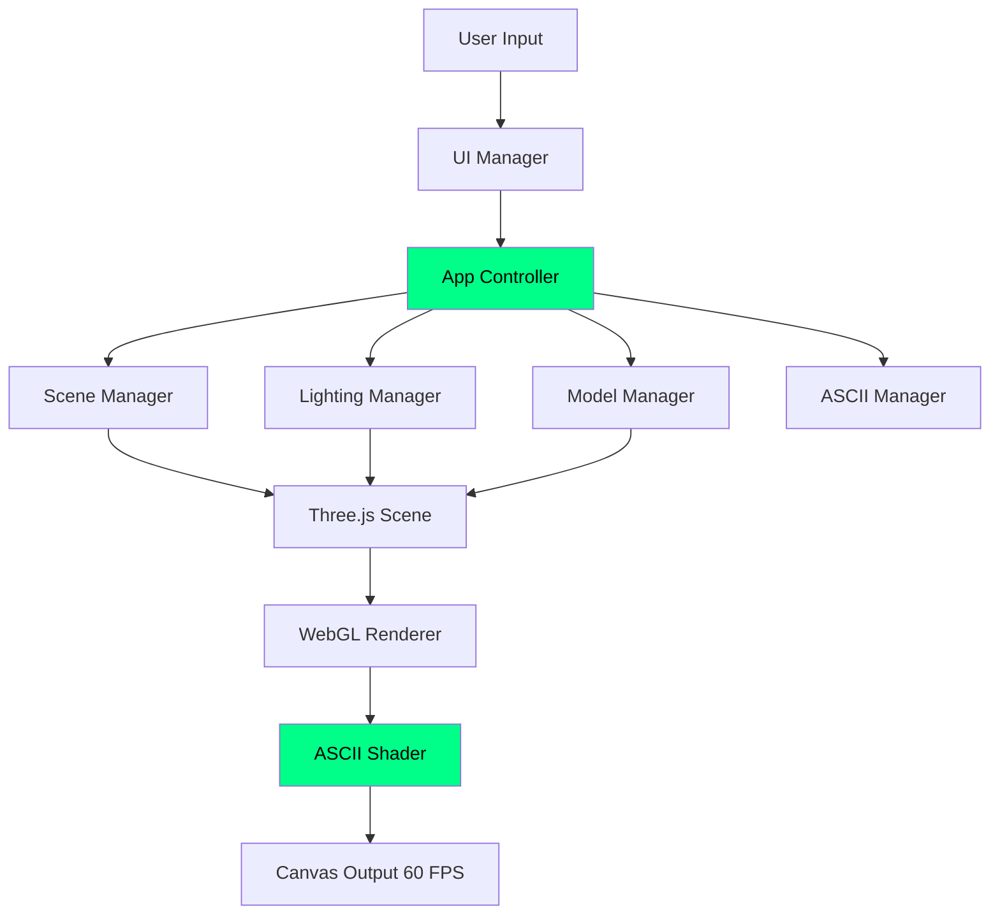

<div align="center">


<br/>


<br/>

<p align="center">
  <a href="https://zacsluss.github.io/ascii_3d_animator"></a>
  <a href="https://github.com/Zacsluss/ascii_3d_animator/archive/refs/heads/main.zip"></a>
</p>

<p align="center">
  
  
  
  
</p>

<p align="center">
  
  
  
  
</p>

</div>

<br/>

---

## 👋 Hey, I'm Zac

I work on enterprise platforms by day and build performance-focused projects by night. This ASCII 3D Animator renders animated 3D models as live ASCII art at **60 FPS** using a custom WebGL shader pipeline - actual real-time conversion, not pre-rendered frames.

**Key achievements:**

- **50,000+ characters/frame** at 60 FPS on modern hardware
- **5-point lighting system** with professional presets
- **20+ visual themes** from retro CRT to modern minimalist
- **109 tests** (85% coverage) with full CI/CD pipeline

Built with Three.js r169 and WebGL 2.0 • Works completely offline after initial load

<div align="center">


_Live ASCII conversion of animated 3D models with dynamic lighting and theme switching_

</div>

---

<details>
<summary><b>📚 Table of Contents</b></summary>

<br/>

- [⚡ What This Does](#-what-this-does)
- [🛠️ Tech Stack](#️-tech-stack)
- [🏗️ How It Works - Architecture](#-how-it-works---architecture)
- [🚀 Quick Start](#-quick-start)
  - [📋 Prerequisites](#-prerequisites)
  - [💻 Local Development](#-local-development)
  - [🏗️ Production Build](#-production-build)
  - [🌐 Deploy to GitHub Pages](#-deploy-to-github-pages)
  - [🎨 Customize for Yourself](#-customize-for-yourself)
- [📊 Technical Deep Dive](#-technical-deep-dive)
  - [🎨 ASCII Shader Implementation](#-ascii-shader-implementation)
  - [💡 5-Point Lighting System](#-5-point-lighting-system)
  - [📊 Performance Benchmarks](#-performance-benchmarks)
  - [🧪 Testing & Code Quality](#-testing--code-quality)
  - [⚙️ Advanced Configuration](#-advanced-configuration)
  - [🐛 Troubleshooting](#-troubleshooting)
- [📜 License & Contributing](#-license--contributing)
- [📬 About & Connect](#-about--connect)

</details>

---

<details open>
<summary><b>🛠️ Tech Stack</b></summary>

<div align="center">
<br/>

<p>
  
</p>

<table>
<tr>
<td align="center" width="25%">
<br/>
<sub><b>3D Graphics</b></sub>
</td>
<td align="center" width="25%">
<br/>
<sub><b>Rendering</b></sub>
</td>
<td align="center" width="25%">
<br/>
<sub><b>Testing</b></sub>
</td>
<td align="center" width="25%">
<br/>
<sub><b>Code Quality</b></sub>
</td>
</tr>
</table>

</div>
</details>

---

<details open>
<summary><b>🏗️ Architecture</b></summary>

<br/>



**Pipeline:** GLB models → Three.js scene → WebGL render → ASCII shader → 50,000+ chars/frame @ 60 FPS

</details>

---

<details>
<summary><b>🚀 Quick Start</b></summary>

<br/>

```bash
# Clone and run
git clone https://github.com/Zacsluss/ascii_3d_animator.git
cd ascii_3d_animator
python -m http.server 8000
# Open http://localhost:8000
```

**Requirements:** Chrome 90+, Firefox 88+, or Safari 14+ with WebGL 2.0

**Development:**

```bash
npm install        # Install dev tools
npm test          # Run 109 tests
npm run lint      # Check code quality
```

**Deploy:** Push to GitHub → Enable Pages → Live at `zacsluss.github.io/ascii_3d_animator`

</details>

---

<details>
<summary><b>📊 Performance & Configuration</b></summary>

<br/>

### Performance Metrics

| Metric           | Desktop | Mobile    |
| ---------------- | ------- | --------- |
| **Frame Rate**   | 60 FPS  | 30-45 FPS |
| **Memory**       | ~120 MB | ~90 MB    |
| **Initial Load** | ~8s     | ~15s      |
| **Cached Load**  | <0.5s   | <1s       |
| **Characters**   | 50,000+ | 40,000+   |

### Custom Configuration

Edit `js/constants.js` to customize:

- **Performance:** `BASE_DENSITY` (30000-100000)
- **Themes:** Add to `THEMES` object
- **Models:** Drop GLB files in root directory
- **Lighting:** Modify `LIGHTING.PRESETS`

<details>
<summary><b>⚡ Why This Project?</b></summary>

<br/>

<div align="center">

| Approach           | FPS    | Characters  | Real-time? | Themes  | Lighting    |
| ------------------ | ------ | ----------- | ---------- | ------- | ----------- |
| **This Project**   | **60** | **50,000+** | **✅ Yes** | **20+** | **5-point** |
| Pre-rendered ASCII | 24-30  | 10,000      | ❌ No      | Limited | Basic       |
| Terminal-based     | 10-15  | 5,000       | ❌ No      | 1-2     | None        |
| Canvas 2D          | 30     | 20,000      | ✅ Yes     | 5-10    | Simple      |

</div>

</details>

</details>

---

<details>
<summary><b>📜 License</b></summary>

<br/>

<div align="center">

</div>

**MIT License** © 2024 Zachary Sluss

Free to use, modify, and distribute. See [LICENSE](LICENSE) for full text.

**Contributing:** Fork → Branch → Test → PR with conventional commits (`feat:`, `fix:`, etc.)

</details>

---

<details open>
<summary><b>📬 About & Connect</b></summary>

<br/>

<div align="center">

By day, I work as a **Principal CRM & Enterprise Platforms Solutions Architect**, managing multi-million-dollar Salesforce ecosystems and enterprise integrations across 20+ countries. By night, I build projects like this.

**Always learning, always building.**

<a href="https://zacsluss.github.io/portfolio/">
  
</a>
<a href="https://github.com/Zacsluss">
  
</a>
<a href="https://linkedin.com/in/zacharyjsluss">
  
</a>
<a href="mailto:zacharyjsluss@gmail.com">
  
</a>
<a href="https://zacsluss.github.io/ascii_3d_animator/public/resume.pdf">
  
</a>

<br/>
<br/>

**Found this helpful?** Give it a ⭐ to show support!

**Want to contribute?** See [contributing guidelines](#-license--contributing) above.

**Need help?** [Open an issue](https://github.com/Zacsluss/ascii_3d_animator/issues) or email me.

---


</div>

</details>
