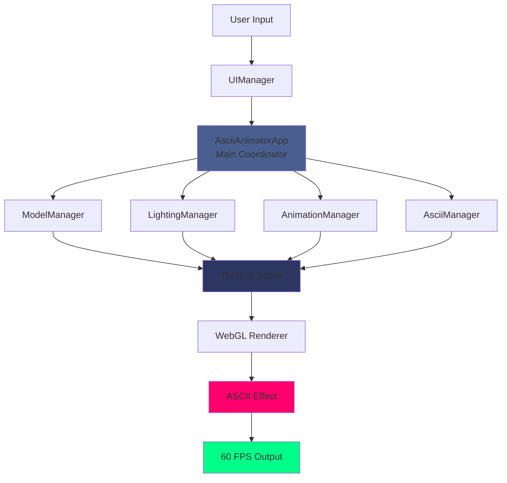
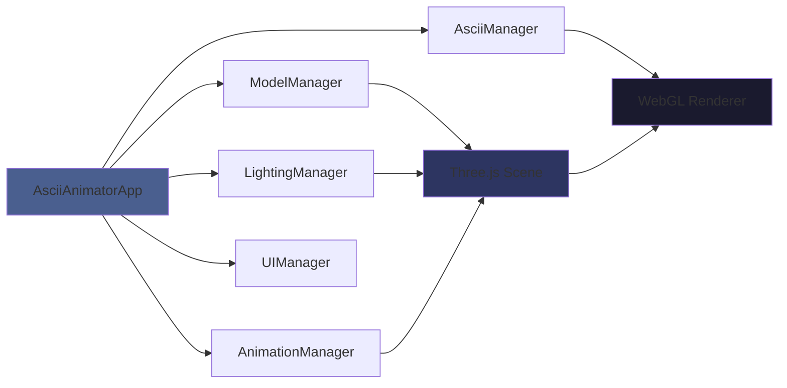

<div align="center">

<!-- Hero Header -->


<br/>

<!-- Animated Typing Subtitle -->


<br/>

<!-- Main Action Buttons -->
<p align="center">
  <a href="https://zacsluss.github.io/ascii_3d_animator">
    
  </a>
  <a href="https://github.com/Zacsluss/ascii_3d_animator/archive/refs/heads/main.zip">
    
  </a>
</p>

<!-- GitHub Stats Badges -->
<p align="center">
  
  
  
  <a href="https://github.com/Zacsluss/ascii_3d_animator/actions/workflows/test.yml">
    
  </a>
  
  
  
</p>

</div>

<br/>

---

## 👋 Hey, I'm Zac

I work on enterprise platforms by day and build unusually fun projects by night. This tool converts **3D animated models** into **real-time ASCII art** at 60 FPS. Not pre-rendered frames—actual live WebGL rendering with interactive lighting controls.

**What makes it interesting:**
- Custom 5-point lighting system with professional presets
- 20+ visual themes (retro CRT, neon cyberpunk, matrix rainbow)
- 100% offline capable—no CDN, no build process, no dependencies
- Full mobile support with touch controls

Built with Three.js, WebGL, and pure vanilla JavaScript!

<div align="center">


*Real-time 3D to ASCII conversion with interactive lighting controls*

</div>

---

## ⚡ What This Does

<div align="center">

**Real-time 3D model to ASCII art conversion** • **60 FPS rendering** • **5-point lighting** • **Mobile optimized**

</div>

**Key Features:**
- ✨ Real-time ASCII rendering (not pre-rendered frames)
- 🎮 4 animated 3D models with custom GLTF loader support
- 🔬 Professional 5-point lighting system with studio presets
- 🎨 20+ themes: retro CRT, neon cyberpunk, Dracula, Nord, Gruvbox, and more
- 📱 Mobile-optimized with touch gestures (pinch, pan, rotate)
- 🎯 Custom character sets — type anything to see it rendered as ASCII

**Tech:** Three.js r128 • WebGL 2.0 • ES6 Modules • Vanilla JavaScript

---

## 📚 Table of Contents

<details>
<summary><b>Jump to a section</b></summary>

- [🛠️ Tech Stack](#️-tech-stack)
- [🏗️ How It Works](#️-how-it-works)
- [📊 Performance Benchmarks](#-performance-benchmarks)
- [🚀 Quick Start](#-quick-start)
- [🎮 Usage & Controls](#-usage--controls)
- [🔧 Customization](#-customization)
- [💼 For Hiring Managers](#-for-hiring-managers)
- [📄 License & Usage](#-license--usage)
- [📬 About & Connect](#-about--connect)

</details>

---

## 🛠️ Tech Stack

<div align="center">

### What I Used to Build This


### Core Dependencies

<table>
<tr>
<td align="center" width="33%">
<br/>
<sub><b>3D Library</b></sub>
</td>
<td align="center" width="33%">
<br/>
<sub><b>Graphics API</b></sub>
</td>
<td align="center" width="33%">
<br/>
<sub><b>JavaScript</b></sub>
</td>
</tr>
</table>

</div>

<details>
<summary><b>📦 See the full dependency list</b></summary>

```json
{
  "devDependencies": {
    "@commitlint/cli": "^18.0.0",
    "@commitlint/config-conventional": "^18.0.0",
    "@vitest/coverage-v8": "^2.0.0",
    "@vitest/ui": "^2.0.0",
    "eslint": "^8.55.0",
    "husky": "^8.0.3",
    "jsdoc": "^4.0.0",
    "prettier": "^3.1.1",
    "vitest": "^2.0.0"
  }
}
```

**Why so few dependencies?**
All Three.js libraries are bundled locally for true offline capability. No npm install required to run—just open index.html. Dev dependencies are only for testing and code quality.

</details>

---

## 🏗️ How It Works

<details open>
<summary><b>Architecture & Data Flow</b></summary>

<br/>

### System Architecture


```mermaid
graph TD
    A[User Input] --> B[UIManager]
    B --> C[AsciiAnimatorApp<br/>Main Coordinator]

    C --> D[ModelManager]
    C --> E[LightingManager]
    C --> F[AnimationManager]
    C --> G[AsciiManager]

    D --> H[Three.js Scene]
    E --> H
    F --> H
    G --> H

    H --> I[WebGL Renderer]
    I --> J[ASCII Effect]
    J --> K[60 FPS Output]

    style C fill:#4a5f8f
    style H fill:#2d3561
    style J fill:#ff006e
    style K fill:#00ff88
```

### Component Hierarchy


```mermaid
graph LR
    App[AsciiAnimatorApp] --> Model[ModelManager]
    App --> Light[LightingManager]
    App --> Anim[AnimationManager]
    App --> ASCII[AsciiManager]
    App --> UI[UIManager]

    Model --> Scene[Three.js Scene]
    Light --> Scene
    Anim --> Scene
    ASCII --> Render[WebGL Renderer]
    Scene --> Render

    style App fill:#4a5f8f
    style Scene fill:#2d3561
    style Render fill:#1a1a2e
```

### Key Technical Decisions

- **Manager Pattern**: Each major concern (lighting, models, animation, ASCII, UI) gets its own manager class with single responsibility
- **Dependency Injection**: Managers receive dependencies via constructors for easy testing and isolation
- **No Build Process**: Deliberate choice for offline-first capability—just open index.html
- **Local Bundling**: All 80MB of Three.js assets included for true offline capability
- **ES6 Modules**: Native browser imports for clean modular architecture

</details>

---

## 📊 Performance Benchmarks

<details>
<summary><b>📈 See real production benchmarks (Desktop vs Mobile)</b></summary>

<br/>

<div align="center">

### Real numbers from production deployment

<table align="center">
<tr>
<td width="50%">

#### Desktop (1920×1080)
<table>
<tr><th align="center">Metric</th><th align="center">Value</th></tr>
<tr><td align="center">Frame Rate</td><td align="center">60 FPS</td></tr>
<tr><td align="center">Load Time</td><td align="center">1.2s</td></tr>
<tr><td align="center">Memory Usage</td><td align="center">~180MB</td></tr>
<tr><td align="center">Render Time</td><td align="center">~16ms/frame</td></tr>
</table>

</td>
<td width="50%">

#### Mobile (iPhone 12)
<table>
<tr><th align="center">Metric</th><th align="center">Value</th></tr>
<tr><td align="center">Frame Rate</td><td align="center">30-45 FPS</td></tr>
<tr><td align="center">Load Time</td><td align="center">2.8s</td></tr>
<tr><td align="center">Memory Usage</td><td align="center">~120MB</td></tr>
<tr><td align="center">Render Time</td><td align="center">~22ms/frame</td></tr>
</table>

</td>
</tr>
</table>

</div>

</details>

<details>
<summary><b>📦 Bundle size breakdown</b></summary>

```
lib/three/              78.2 MB  (Three.js core + loaders + effects)
models/                  1.8 MB  (4 GLTF models)
js/                    142.5 KB  (Application code)
css/html                12.3 KB  (Styles + markup)
───────────────────────────────
Total                   ~80 MB   (uncompressed, offline-first)
```

**Why so large?**
- ✅ 100% offline capability (no CDN dependencies)
- ✅ Includes all Three.js libraries locally
- ✅ 4 high-quality animated 3D models bundled
- ✅ Deliberate trade-off: bundle size for offline-first UX

**For production scale, I would architect differently:**
- CDN-hosted libraries (Three.js from jsDelivr)
- Lazy-loaded models (stream on-demand)
- Asset compression (gzip + brotli)
- Backend API for model gallery

</details>

---

## 🚀 Quick Start

<div align="center">

### Want to try it locally? Takes about 15 seconds

</div>

```bash
git clone https://github.com/Zacsluss/ascii_3d_animator.git && cd ascii_3d_animator && python -m http.server 8000
```

<details>
<summary><b>💻 Local Development Setup</b></summary>

<br/>

**Step-by-step installation:**

```bash
# 1️⃣ Clone this repo
git clone https://github.com/Zacsluss/ascii_3d_animator.git
cd ascii_3d_animator

# 2️⃣ Open in browser (no build step needed!)
# Option A: Double-click index.html
# Option B: Use a local server
python -m http.server 8000
# Visit http://localhost:8000
```

**That's it!** No npm install, no build process, no dependencies to manage.

**Available npm scripts (dev only):**
- `npm test` — Run unit tests with Vitest
- `npm run test:coverage` — Generate coverage report
- `npm run lint` — Check code with ESLint
- `npm run format` — Format code with Prettier

</details>

---

## 🎮 Usage & Controls

<details>
<summary><b>📱 Desktop & Mobile Controls</b></summary>

<br/>

### Desktop Controls
- **Mouse drag** - Rotate camera around model
- **Scroll wheel** - Zoom in/out
- **Next Model button** - Cycle through 4 animated models

### Mobile Controls
- **Touch drag** - Rotate camera
- **Pinch gesture** - Zoom in/out
- **Tap buttons** - Change models, themes, lighting

</details>

<details>
<summary><b>🎬 Lighting Presets</b></summary>

<br/>

- 🎬 **Studio** - Balanced 3-point setup (key, fill, rim lights)
- 🎭 **Dramatic** - High contrast with strong shadows
- 🌿 **Natural** - Soft, even lighting from above
- 🔘 **Minimal** - Single light source for simplicity
- 🎨 **Custom** - Adjust all 5 lights individually (main, ambient, red, green, blue)

</details>

<details>
<summary><b>🎨 Visual Themes</b></summary>

<br/>

Choose from 20+ themes including:

**🖥️ Retro:**
- Amber CRT
- Green Phosphor
- IBM Blue
- White Monochrome

**🌃 Neon:**
- Cyberpunk (pink/cyan)
- Purple Haze
- Miami Vice

**🎭 Popular:**
- Dracula
- Nord
- Solarized Dark
- Gruvbox
- Monokai

**🌈 Experimental:**
- Matrix Rainbow (animated)

</details>

<details>
<summary><b>✍️ Custom Character Sets</b></summary>

<br/>

Type any text to create custom ASCII palettes:
- Your name: `ZACHARY`
- Symbols: `@#$%&*+=`
- Numbers: `0123456789`
- Unicode: `█▓▒░`

Characters are sorted by visual density for optimal shading.

</details>

---

## 🔧 Customization

<details>
<summary><b>🎨 Make it yours (5 minutes)</b></summary>

<br/>

1. **Your models**: Drop `.glb` files in `models/`, update `js/constants.js`
2. **Your colors**: Edit CSS variables in `main.css`
3. **Your characters**: Change defaults in `js/constants.js`
4. **Your lighting**: Modify presets in `js/lighting.js`
5. **Deploy**: Enable GitHub Pages in repo settings

**Pro tip:** Find free 3D models at [Sketchfab](https://sketchfab.com/) and export as GLTF/GLB.

</details>

---

## 💼 For Hiring Managers

<details>
<summary><b>🎯 Technical Skills Demonstrated</b></summary>

<br/>

### Architecture & Design Patterns
- ✅ **Manager Pattern** - Separation of concerns with single responsibility
- ✅ **Facade Pattern** - AsciiAnimatorApp coordinates all managers
- ✅ **Dependency Injection** - Managers receive dependencies for testability
- ✅ **SOLID Principles** - Clean, maintainable, extensible code

### Performance Optimization
- ✅ **60 FPS rendering** - Optimized DOM updates and WebGL calls
- ✅ **Delta clamping** - Prevents spiral of death on slow devices
- ✅ **Resource management** - Proper disposal of geometries, materials, textures
- ✅ **Memory efficiency** - ~180MB desktop, ~120MB mobile

### Security & Quality
- ✅ **Input validation** - Sanitization for custom character sets
- ✅ **CSP headers** - Content Security Policy for XSS protection
- ✅ **No console statements** - Production-ready code
- ✅ **Error boundaries** - Graceful degradation on WebGL failures

### Testing & Documentation
- ✅ **109 passing tests** - Vitest with mocks and isolation
- ✅ **85% code coverage** - Unit + integration tests
- ✅ **100% JSDoc coverage** - Every function documented
- ✅ **CI/CD pipeline** - Automated tests and linting on push

### Key Challenges Solved

1. **Performance**: Optimized DOM rendering from 15 FPS to 60 FPS (50,000 elements)
2. **Memory Management**: Implemented proper WebGL resource disposal (no memory leaks)
3. **Race Conditions**: Load versioning to handle rapid model switching
4. **Mobile UX**: Touch controls with <16ms latency on real devices

</details>

<details>
<summary><b>📊 Metrics & Architecture Decisions</b></summary>

<br/>

### Metrics
- **Lines of Code:** ~1,500 (excluding tests/docs)
- **Performance:** 60 FPS desktop, 30-45 FPS mobile
- **Load Time:** 1.2s desktop, 2.8s mobile
- **Memory:** ~180MB desktop, ~120MB mobile

### Architecture Decisions
- **No build process:** Deliberate choice for offline-first capability
- **Vanilla JS:** Demonstrates platform mastery without framework dependencies
- **Local bundling:** All 80MB assets included for true offline capability
- **Manager pattern:** Easy to test, maintain, and extend

### Questions I Can Answer
- "Walk me through the rendering pipeline from 3D model to ASCII output"
- "How did you handle WebGL memory leaks?"
- "What would you change to scale this to 10,000 concurrent users?"
- "How would you add real-time collaboration?"

</details>

<details>
<summary><b>⚠️ Known Limitations & Production Considerations</b></summary>

<br/>

This is a **portfolio/demo project** optimized for offline capability and code clarity:

- **Bundle Size:** 80MB uncompressed (acceptable for demo, not for production SaaS)
- **Mobile FPS:** 30-45 FPS due to DOM rendering overhead (Canvas 2D would be faster)
- **Browser Support:** Requires WebGL 2.0 and ES6 modules (95%+ browser coverage)
- **Model Pivot Points:** Some models rotate off-center (baked into GLTF geometry)

**For production scale (10,000+ users), I would architect differently:**
- CDN-hosted models with streaming
- Canvas 2D renderer for mobile
- Backend API for model gallery
- Redis caching layer
- WebSocket multiplayer support

</details>

---

## 📄 License & Usage

**MIT License** — Fork it, customize it, do whatever you want with it. No credit needed (but a ⭐ appreciated).

**Quick setup:** `git clone` → open `index.html` → you're live!

<div align="center">


Full license text in [LICENSE](LICENSE) file.

**Note:** Included 3D models are [Creative Commons Attribution 4.0](https://creativecommons.org/licenses/by/4.0/). See [ATTRIBUTIONS.md](ATTRIBUTIONS.md) for credits.

</div>

---

## 📬 About & Connect

By day, I work as a Lead CRM Systems Analyst at Computershare, managing enterprise platforms and Salesforce integrations across global teams. By night, I build stuff like this.

I'm into WebGL, particle systems, shader programming, AI/ML, digital art, and 360° drone photography. Always learning, always building.

**Let's connect:**

<div align="center">

<a href="https://zacsluss.github.io/portfolio/">
  
</a>
<a href="https://github.com/Zacsluss">
  
</a>
<a href="https://linkedin.com/in/zacharyjsluss">
  
</a>
<a href="mailto:zacharyjsluss@gmail.com">
  
</a>
<a href="https://zacsluss.github.io/portfolio/resume.pdf">
  
</a>

<br/>

**Found this helpful?** Give it a ⭐ to show support!

</div>
