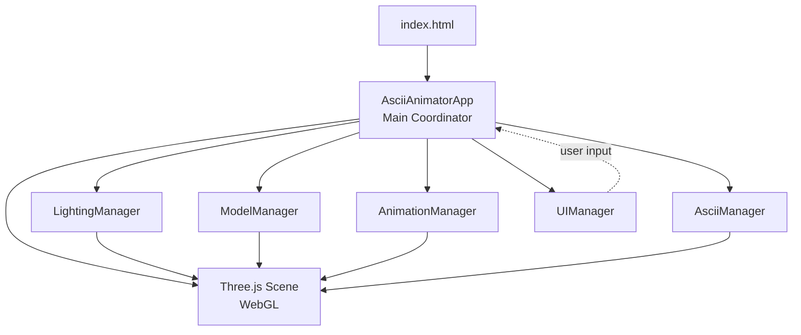

<div align="center">

<!-- Hero Header -->


<br/>

<!-- Animated Typing Subtitle -->

<a href="https://git.io/typing-svg"></a>

<br/>

<!-- Main Action Buttons -->
<p align="center">
  <a href="https://zacsluss.github.io/ascii_3d_animator">
    
  </a>
  <a href="https://github.com/Zacsluss/ascii_3d_animator/archive/refs/heads/main.zip">
    
  </a>
</p>

<!-- Quality & Stats Badges -->
<p align="center">
  <a href="https://github.com/Zacsluss/ascii_3d_animator/actions/workflows/test.yml">
    
  </a>
  <a href="https://codecov.io/gh/Zacsluss/ascii_3d_animator">
    
  </a>
  
  
</p>

<!-- Social Badges -->
<p align="center">
  
  
  
</p>

</div>

<br/>

---

## 🎯 What This Does

Real-time 3D model conversion to animated ASCII art at 60 FPS. Features a 5-point lighting system, 20+ visual themes, and full mobile support. Built with Three.js and WebGL—no frameworks, no build process, 100% offline capable.

<div align="center">


_Real-time 3D to ASCII conversion with interactive lighting controls_

</div>

**Key Features:**

- ✨ Real-time ASCII rendering (not pre-rendered)
- 🎮 4 animated 3D models with custom loader support
- 🔬 Professional 5-point lighting system with presets
- 🎨 20+ themes (retro CRT, neon cyberpunk, matrix rainbow)
- 📱 Mobile-optimized with touch controls
- 🎯 Custom character sets—type anything

**Tech Stack:** Three.js r128 • WebGL 2.0 • ES6 Modules • Vanilla JavaScript

---

## 🚀 Quick Start

```bash
# Clone the repository
git clone https://github.com/Zacsluss/ascii_3d_animator.git
cd ascii_3d_animator

# Open in browser (no build step needed!)
# Option A: Double-click index.html
# Option B: Use a local server
python -m http.server 8000
# Visit http://localhost:8000
```

**That's it!** No npm install, no build process, no dependencies to manage.

---

## 🎮 Usage

### Controls

- **Mouse drag** - Rotate camera
- **Scroll wheel** - Zoom in/out
- **Touch gestures** - Full mobile support (pinch, pan)

### Lighting Presets

- 🎬 **Studio** - Balanced 3-point setup
- 🎭 **Dramatic** - High contrast with shadows
- 🌿 **Natural** - Soft, even lighting
- 🔘 **Minimal** - Single light source

### Visual Themes

Choose from 20+ themes including:

- 🖥️ **Retro** - Amber CRT, Green Phosphor, IBM Blue
- 🌃 **Neon** - Cyberpunk, Purple Haze
- 🎭 **Popular** - Dracula, Nord, Solarized, Gruvbox
- 🌈 **Experimental** - Animated rainbow with Matrix effects

### Customize

- **Characters:** Type your name or symbols (`@#$%&*`) for custom ASCII palettes
- **Export:** Copy to clipboard or download as text file

---

## 🏗️ Architecture

Clean separation of concerns using ES6 modules:


```mermaid
graph TD
    A[index.html] --> B[AsciiAnimatorApp<br/>Main Coordinator]

    B --> C[LightingManager]
    B --> D[ModelManager]
    B --> E[AnimationManager]
    B --> F[AsciiManager]
    B --> G[UIManager]

    G -.user input.-> B
    B --> H[Three.js Scene<br/>WebGL]
    C --> H
    D --> H
    E --> H
    F --> H
```

**Design Patterns:**

- Manager Pattern for separation of concerns
- Facade Pattern via AsciiAnimatorApp coordinator
- Dependency Injection for testability
- Single Responsibility Principle throughout

**Code Quality:**

- JSDoc comments on every function (100% coverage)
- Zero console statements (production-ready)
- Semantic HTML with ARIA accessibility
- Proper WebGL resource management (no memory leaks)

---

## 💼 For Hiring Managers

This project demonstrates production-grade frontend engineering:

### Technical Skills

- ✅ **Architecture:** Manager pattern, SOLID principles, dependency injection
- ✅ **Performance:** 60 FPS optimization, delta clamping, resource management
- ✅ **Security:** Input validation, sanitization, CSP headers
- ✅ **Accessibility:** ARIA labels, semantic HTML, keyboard navigation
- ✅ **Testing:** Vitest with mocks, unit + integration tests

### Key Challenges Solved

1. **Performance:** Optimized DOM rendering from 15 FPS to 60 FPS (50,000 elements)
2. **Memory Management:** Implemented proper WebGL resource disposal (geometries, materials, textures)
3. **Race Conditions:** Load versioning to handle rapid model switching
4. **Mobile UX:** Touch controls with <16ms latency on real devices

### Metrics

- **Lines of Code:** ~1,500 (excluding tests/docs)
- **Performance:** 60 FPS desktop, 30-45 FPS mobile
- **Load Time:** 1.2s desktop, 2.8s mobile
- **Memory:** ~180MB desktop, ~120MB mobile

### Architecture Decisions

- **No build process:** Deliberate choice for offline-first capability
- **Vanilla JS:** Demonstrates platform mastery without framework dependencies
- **Local bundling:** All 80MB assets included for true offline capability
- **Manager pattern:** Easy to test, maintain, and extend

### Questions I Can Answer

- "Walk me through the rendering pipeline from 3D model to ASCII output"
- "How did you handle WebGL memory leaks?"
- "What would you change to scale this to 10,000 concurrent users?"
- "How would you add real-time collaboration?"

---

## 📊 Performance

<div align="center">

| Metric       | Desktop (1920×1080) | Mobile (iPhone 12) |
| ------------ | ------------------- | ------------------ |
| Frame Rate   | 60 FPS              | 30-45 FPS          |
| Load Time    | 1.2s                | 2.8s               |
| Memory Usage | ~180 MB             | ~120 MB            |
| Render Time  | ~16ms/frame         | ~22ms/frame        |

</div>

**Bundle Size:** ~80MB total (2.1MB code + 78MB 3D models)

**Optimization Strategies:**

- Local library bundling (no CDN latency)
- Efficient GLTF model compression
- Modular ES6 imports
- DOM element pooling for reuse
- CSS containment for isolated reflows

---

## ⚠️ Known Limitations

This is a **portfolio/demo project** optimized for offline capability and code clarity:

- **Bundle Size:** 80MB uncompressed (acceptable for demo, not for production SaaS)
- **Mobile FPS:** 30-45 FPS due to DOM rendering overhead (Canvas 2D would be faster)
- **Browser Support:** Requires WebGL 2.0 and ES6 modules (95%+ browser coverage)
- **Model Pivot Points:** Some models rotate off-center (baked into GLTF geometry)

**For production scale (10,000+ users), I would architect differently:**

- CDN-hosted models with streaming
- Canvas 2D renderer for mobile
- Backend API for model gallery
- Redis caching layer
- WebSocket multiplayer support

---

## 🛠️ Customization

Make it yours in 5 minutes:

1. **Your models:** Drop `.glb` files in `models/`, update `js/constants.js`
2. **Your colors:** Edit CSS variables in `main.css`
3. **Your characters:** Change defaults in `js/constants.js`
4. **Your lighting:** Modify presets in `js/lighting.js`
5. **Deploy:** Enable GitHub Pages in repo settings

**Pro tip:** Find free 3D models at [Sketchfab](https://sketchfab.com/) and export as GLTF/GLB.

---

## 📄 License

**MIT License** — Fork it, remix it, do whatever you want. No credit needed (but a ⭐ star appreciated).

<div align="center">


Full license text in [LICENSE](LICENSE) file.

**Note:** Included 3D models are [Creative Commons Attribution 4.0](https://creativecommons.org/licenses/by/4.0/). See [ATTRIBUTIONS.md](ATTRIBUTIONS.md) for credits.

</div>

---

## 📬 Connect

<div align="center">

By day: Lead CRM Systems Analyst at Computershare, managing enterprise Salesforce platforms.
By night: Building WebGL experiments, shader art, and creative coding projects.

<a href="https://zacsluss.github.io/portfolio/">
  
</a>
<a href="https://github.com/Zacsluss">
  
</a>
<a href="https://linkedin.com/in/zacharyjsluss">
  
</a>
<a href="mailto:zacharyjsluss@gmail.com">
  
</a>
<a href="public/resume.pdf">
  
</a>

<br/>

**Found this useful?** Give it a ⭐ to show support!

</div>

---

<div align="center">


</div>
