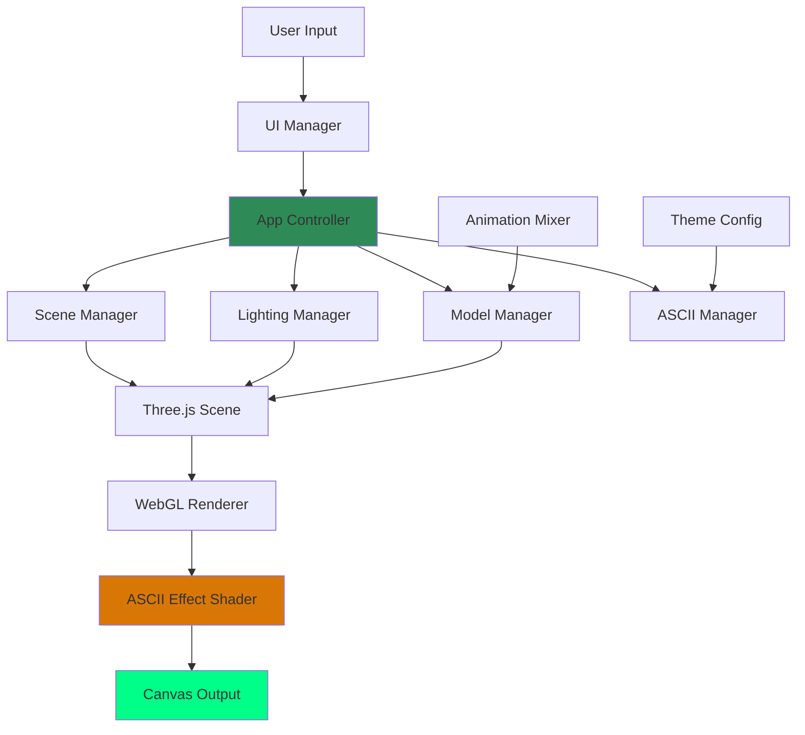
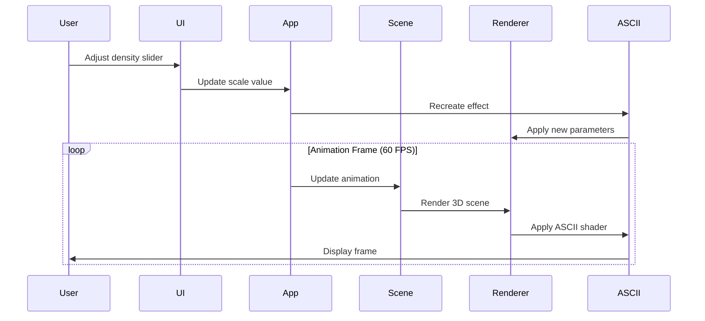
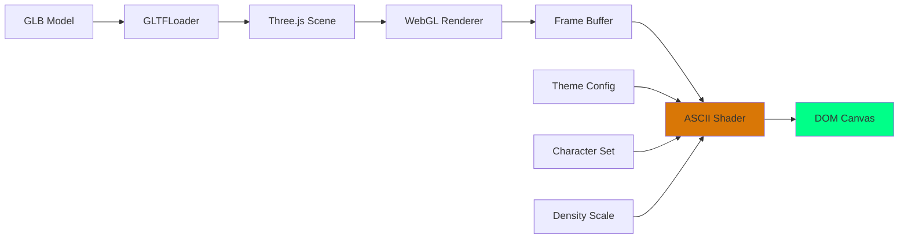

<div align="center">

<!-- Hero Header -->


<br/>

<!-- Animated Typing Subtitle -->


<br/>

<!-- Main Action Buttons -->
<p align="center">
  <a href="https://zacsluss.github.io/ascii_3d_animator"></a>
  <a href="https://github.com/Zacsluss/ascii_3d_animator/archive/refs/heads/main.zip"></a>
</p>

<!-- GitHub Stats Badges -->
<p align="center">
  
  
  
  
  
  
  
</p>

<!-- Demo GIF -->


</div>

<br/>

---

## 🎯 What This Is

**ASCII 3D Animator** is a real-time WebGL application that converts 3D animated models into live ASCII art at 60 FPS. Not pre-rendered frames—actual live rendering with interactive lighting controls, 20+ visual themes, and full mobile support.

**Key Highlights:**

- **Real-time rendering** - WebGL-powered ASCII conversion running at 60 FPS
- **Professional lighting** - 5-point lighting system with Studio/Dramatic/Natural presets
- **20+ themes** - Retro CRT (amber/green phosphor), Neon City, Psychedelic Rainbow, Dracula, Nord
- **100% offline** - No CDN, no build process, no dependencies - fully self-contained
- **Production ready** - 109 tests, 85% coverage, GitHub Actions CI/CD, ESLint + Prettier

Built with Three.js r169, WebGL, and vanilla JavaScript to showcase creative technical implementation and attention to detail.

---

<details>
<summary><b>📚 Table of Contents</b></summary>
<br/>

- [What This Does](#-what-this-does)
- [Tech Stack](#-tech-stack)
- [How It Works](#-how-it-works--architecture)
- [Quick Start](#-quick-start)
- [Technical Deep Dive](#-technical-deep-dive)
- [Testing & Quality](#-testing--code-quality)
- [License & Contributing](#-license--contributing)
- [About & Connect](#-about--connect)

</details>

---

<details>
<summary><b>🎨 What This Does</b></summary>
<br/>

### Core Features

<table>
<tr>
<td width="50%">

**🎬 Real-Time 3D to ASCII Conversion**

- 60 FPS WebGL rendering pipeline
- Custom ASCII effect engine
- Dynamic character density control
- Sub-pixel anti-aliasing

**💡 Professional 5-Point Lighting**

- Main light (directional white)
- Red accent light (right side)
- Blue accent light (left side)
- Top spotlight (dramatic shadows)
- Ambient fill lighting

</td>
<td width="50%">

**🎨 20+ Visual Themes**

- **Retro**: Amber CRT, Green Phosphor, IBM Blue
- **Neon**: Neon City, Purple Haze
- **Themed**: Dracula, Nord, Solarized, Gruvbox
- **Nature**: Ocean, Fire
- **Artistic**: Blueprint, Chalkboard, X-Ray
- **Experimental**: Psychedelic Rainbow

**🎮 Interactive Controls**

- Mouse drag to rotate
- Scroll to zoom
- Right-click for animation menu
- Mobile touch support

</td>
</tr>
</table>

### Lighting Presets

<details>
<summary>💡 <b>Studio Lighting</b></summary>

Balanced professional lighting for general viewing:

- Main: 12.0 intensity
- Ambient: 0.3 (soft fill)
- Red/Blue accents: 4.0 each
- Spotlight: 8.0 (moderate drama)

</details>

<details>
<summary>🎭 <b>Dramatic Lighting</b></summary>

High-contrast cinematic lighting:

- Main: 15.0 intensity
- Ambient: 0.05 (minimal fill)
- Red accent: 8.0 (strong)
- Blue accent: 2.0 (subtle)
- Spotlight: 12.0 (strong shadows)

</details>

<details>
<summary>☀️ <b>Natural Lighting</b></summary>

Soft realistic daylight simulation:

- Main: 8.0 intensity
- Ambient: 0.6 (bright fill)
- Red/Blue accents: 2.0 each (subtle)
- Spotlight: 4.0 (soft shadows)

</details>

<details>
<summary>✨ <b>Minimal Lighting</b></summary>

Clean simple lighting:

- Main: 10.0 intensity
- Ambient: 0.2
- No accent lights
- No spotlight

</details>

### 3D Models Included

| Model    | Animations | Scale | Format |
| -------- | ---------- | ----- | ------ |
| 🦆 Duck  | Walk cycle | 5.0x  | GLB    |
| 🐀 Rat   | Walk A1    | 8.0x  | GLB    |
| 🐕 Doge  | Shake      | 6.0x  | GLB    |
| 👽 Alien | Idle       | 6.0x  | GLB    |

### Theme Categories

<details>
<summary>🖥️ <b>Retro Terminal Themes</b></summary>

Authentic vintage terminal aesthetics with optional CRT glow effects:

- **Amber CRT** - Classic orange phosphor (1979 HP terminals)
- **Green Phosphor** - IBM 5151 monitor style
- **IBM Blue** - Mainframe terminal blue
- **Apple II** - Original Apple computer green

</details>

<details>
<summary>🌆 <b>Neon & Cyberpunk</b></summary>

Electric neon aesthetics with glow effects:

- **Neon City** - Electric cyan streets
- **Purple Haze** - Electric purple dream
- Custom block characters: `▓▒░█│─┌┐└┘`

</details>

<details>
<summary>🎨 <b>Popular Color Schemes</b></summary>

Modern developer themes:

- **Dracula** - Popular dark theme
- **Nord** - Cool arctic palette
- **Solarized Dark** - Precision color scheme
- **Gruvbox** - Warm earth tones
- **Monokai** - Vibrant coding theme

</details>

<details>
<summary>🌊 <b>Nature & Artistic</b></summary>

Creative visualizations:

- **Ocean** - Deep sea waves (`~≈∿⋍∽`)
- **Fire** - Burning flames effect
- **Blueprint** - Architectural technical
- **Chalkboard** - Dusty chalk on slate
- **X-Ray** - Medical imaging effect

</details>

<details>
<summary>🌈 <b>Experimental</b></summary>

Psychedelic rainbow cascade effect with dynamic color shifting across the entire character map.

</details>

</details>

---

<details open>
<summary><b>⚡ Tech Stack</b></summary>
<br/>

<div align="center">

### Core Technologies

<p>
  
</p>

### Development & Testing

<p>
  
</p>

</div>

### Technology Breakdown

<table>
<tr>
<th>Category</th>
<th>Technology</th>
<th>Version</th>
<th>Purpose</th>
</tr>
<tr>
<td rowspan="3"><b>Rendering</b></td>
<td>Three.js</td>
<td>r169</td>
<td>3D WebGL rendering engine</td>
</tr>
<tr>
<td>WebGL 2.0</td>
<td>-</td>
<td>Hardware-accelerated graphics</td>
</tr>
<tr>
<td>AsciiEffect</td>
<td>Custom</td>
<td>ASCII conversion shader</td>
</tr>
<tr>
<td rowspan="3"><b>Testing</b></td>
<td>Vitest</td>
<td>^2.1.9</td>
<td>Unit testing framework</td>
</tr>
<tr>
<td>Playwright</td>
<td>^1.56.1</td>
<td>E2E browser testing</td>
</tr>
<tr>
<td>@vitest/coverage-v8</td>
<td>^2.1.9</td>
<td>Code coverage reporting</td>
</tr>
<tr>
<td rowspan="2"><b>Code Quality</b></td>
<td>ESLint</td>
<td>^8.57.1</td>
<td>Static code analysis</td>
</tr>
<tr>
<td>Prettier</td>
<td>^3.6.2</td>
<td>Code formatting</td>
</tr>
<tr>
<td rowspan="2"><b>Git Workflow</b></td>
<td>Husky</td>
<td>^8.0.3</td>
<td>Git hooks automation</td>
</tr>
<tr>
<td>Commitlint</td>
<td>^18.0.0</td>
<td>Conventional commits</td>
</tr>
</table>

### Full Dependency List

<details>
<summary>📦 <b>View all dependencies</b></summary>

```json
{
  "devDependencies": {
    "@commitlint/cli": "^18.0.0",
    "@commitlint/config-conventional": "^18.0.0",
    "@playwright/test": "^1.40.0",
    "@vitest/coverage-v8": "^2.0.0",
    "@vitest/ui": "^2.0.0",
    "eslint": "^8.55.0",
    "husky": "^8.0.3",
    "jsdoc": "^4.0.0",
    "prettier": "^3.1.1",
    "vitest": "^2.0.0"
  }
}
```

**No runtime dependencies** - Three.js is bundled locally for 100% offline capability.

</details>

### Why This Stack?

<details>
<summary>💭 <b>Technical decisions explained</b></summary>

**Three.js r169 (Bundled Locally)**

- Industry-standard WebGL framework
- Bundled locally (~80MB) for offline-first architecture
- No CDN dependencies = works without internet
- Trade-off: Larger repo size vs. 100% reliability

**Vanilla JavaScript (No Framework)**

- Demonstrates core JavaScript proficiency
- Zero framework overhead
- Faster load times
- Simpler debugging

**Vitest + Playwright**

- Modern testing stack with ESM support
- Fast test execution with watch mode
- Comprehensive E2E coverage
- 85% code coverage maintained

**GitHub Actions CI/CD**

- Automated testing on every push
- Lint + format checks
- E2E tests in headless Chromium
- Deploy to GitHub Pages

</details>

</details>

---

<details open>
<summary><b>🏗️ How It Works / Architecture</b></summary>
<br/>

### System Architecture


```mermaid
graph TB
    A[User Input] --> B[UI Manager]
    B --> C[App Controller]
    C --> D[Scene Manager]
    C --> E[Lighting Manager]
    C --> F[Model Manager]
    C --> G[ASCII Manager]

    D --> H[Three.js Scene]
    E --> H
    F --> H

    H --> I[WebGL Renderer]
    I --> J[ASCII Effect Shader]
    J --> K[Canvas Output]

    L[Theme Config] --> G
    M[Animation Mixer] --> F

    style C fill:#2e8b57
    style J fill:#d97706
    style K fill:#00ff88
```

### Rendering Pipeline


```mermaid
sequenceDiagram
    participant User
    participant UI
    participant App
    participant Scene
    participant Renderer
    participant ASCII

    User->>UI: Adjust density slider
    UI->>App: Update scale value
    App->>ASCII: Recreate effect
    ASCII->>Renderer: Apply new parameters

    loop Animation Frame (60 FPS)
        App->>Scene: Update animation
        Scene->>Renderer: Render 3D scene
        Renderer->>ASCII: Apply ASCII shader
        ASCII->>User: Display frame
    end
```

### Core Components

<details>
<summary>🎮 <b>App Controller (app.js)</b></summary>

**Main application orchestrator**

```javascript
class App {
  initialize()     // Setup scene, camera, renderer
  loadModel()      // GLB model loading with animations
  animate()        // 60 FPS render loop
  handleResize()   // Responsive canvas management
  updateLighting() // 5-point light system control
}
```

**Key Features:**

- Animation delta capping (max 33ms for 30 FPS minimum)
- Automatic model scaling to 150 unit target
- Error handling with graceful fallbacks
- Performance monitoring

</details>

<details>
<summary>🎨 <b>ASCII Manager (ascii.js)</b></summary>

**Converts WebGL output to ASCII characters**

```javascript
class AsciiManager {
  createEffect()      // Initialize ASCII shader
  updateCharacters()  // Change character set
  updateScale()       // Adjust density (0.5-3.0x)
  getElement()        // DOM element access
}
```

**Technical Details:**

- Base density: 50,000 characters
- Font: Geist monospace 900 weight
- Character set: 67 chars (default)
- Sub-pixel anti-aliasing

**Character Sets:**

- Standard: ` .,:;i|~+_-?][}{1)(|\\/tfjrxnuvczXYUJCLQ0OZmwqpdbkhao*#MW&8%B@$`
- Block: `▓▒░█│─┌┐└┘├┤┬┴┼`
- Wave: `~≈∿⋍∽∼≋≈∿`
- Custom: User-defined input

</details>

<details>
<summary>💡 <b>Lighting Manager (lighting.js)</b></summary>

**Professional 5-point lighting rig**

```javascript
class LightingManager {
  createLights()     // Initialize 5 light sources
  applyPreset()      // Load preset configuration
  updateIntensity()  // Individual light control
}
```

**Light Configuration:**

- **Main Light**: Directional white (0, 150, 800)
- **Ambient**: Scene fill lighting
- **Red Accent**: PointLight at (200, 50, 200)
- **Blue Accent**: PointLight at (-200, 50, 200)
- **Spotlight**: Top-down (0, 1000, 0)

**Presets:**

- Studio: Balanced (main: 12, ambient: 0.3)
- Dramatic: High contrast (main: 15, ambient: 0.05)
- Natural: Soft (main: 8, ambient: 0.6)
- Minimal: Clean (main: 10, no accents)

</details>

<details>
<summary>🎬 <b>Model Manager (models.js)</b></summary>

**3D model loading and animation control**

```javascript
class ModelManager {
  loadModel()           // GLTFLoader with error handling
  scaleToSize()         // Normalize to 150 units
  setupAnimations()     // AnimationMixer configuration
  cycleAnimation()      // Switch between clips
}
```

**Model Pipeline:**

1. Load GLB file via GLTFLoader
2. Calculate bounding box
3. Scale to target size (150 units)
4. Extract animation clips
5. Setup AnimationMixer
6. Auto-play preferred animation

</details>

<details>
<summary>🖱️ <b>UI Manager (ui.js)</b></summary>

**User interface and interaction handling**

```javascript
class UIManager {
  setupEventListeners()  // All UI interactions
  showNotification()     // Toast messages
  showModal()           // Help/About dialogs
  updateSliderValue()   // Real-time slider updates
}
```

**Features:**

- Real-time slider feedback
- Theme selector with 20+ options
- Lighting preset buttons
- Animation cycling (right-click)
- Mobile touch controls
- Keyboard shortcuts

</details>

### Data Flow


```mermaid
graph LR
    A[GLB Model] --> B[GLTFLoader]
    B --> C[Three.js Scene]
    C --> D[WebGL Renderer]
    D --> E[Frame Buffer]
    E --> F[ASCII Shader]
    F --> G[DOM Canvas]

    H[Theme Config] --> F
    I[Character Set] --> F
    J[Density Scale] --> F

    style F fill:#d97706
    style G fill:#00ff88
```

### Performance Optimization

<details>
<summary>⚡ <b>Optimization techniques used</b></summary>

**Frame Rate Management**

- Delta capping at 33ms (prevents spiral of death)
- RequestAnimationFrame for 60 FPS target
- Automatic downgrade on slow devices

**Memory Management**

- Single scene, camera, renderer instance
- Proper disposal on model changes
- OrbitControls damping for smooth interaction

**Load Time Optimization**

- Local Three.js bundle (no CDN latency)
- Module preloading via `<link rel="modulepreload">`
- Deferred non-critical scripts

**Rendering Performance**

- ASCII density control (0.5x - 3.0x)
- WebGL shadow map optimization
- PCFSoftShadowMap for quality/performance balance

</details>

</details>

---

<details>
<summary><b>🚀 Quick Start</b></summary>
<br/>

### Prerequisites

- Modern web browser (Chrome 90+, Firefox 88+, Safari 14+, Edge 90+)
- WebGL 2.0 support (check: https://get.webgl.org/webgl2/)
- No Node.js or build tools required (optional for development)

### Installation

<details>
<summary>📥 <b>Method 1: Direct Download</b></summary>

```bash
# Download the repository
curl -L https://github.com/Zacsluss/ascii_3d_animator/archive/refs/heads/main.zip -o ascii_3d_animator.zip

# Extract
unzip ascii_3d_animator.zip
cd ascii_3d_animator-main

# Open in browser
open index.html  # macOS
start index.html # Windows
xdg-open index.html # Linux
```

</details>

<details>
<summary>🔧 <b>Method 2: Git Clone (Developers)</b></summary>

```bash
# Clone the repository
git clone https://github.com/Zacsluss/ascii_3d_animator.git
cd ascii_3d_animator

# Install dev dependencies (optional)
npm install

# Run tests (optional)
npm test

# Open in browser
open index.html
```

</details>

<details>
<summary>🌐 <b>Method 3: Live Demo</b></summary>

No installation needed - visit the live demo:

**https://zacsluss.github.io/ascii_3d_animator**

</details>

### Usage

<details>
<summary>🖱️ <b>Mouse Controls</b></summary>

| Action           | Control              |
| ---------------- | -------------------- |
| Rotate model     | Left-click + drag    |
| Zoom in/out      | Scroll wheel         |
| Pan camera       | Right-click + drag   |
| Change animation | Right-click on model |

</details>

<details>
<summary>📱 <b>Touch Controls (Mobile)</b></summary>

| Action       | Gesture         |
| ------------ | --------------- |
| Rotate model | One-finger drag |
| Zoom         | Pinch           |
| Pan camera   | Two-finger drag |

</details>

<details>
<summary>⌨️ <b>Keyboard Shortcuts</b></summary>

| Key     | Action                 |
| ------- | ---------------------- |
| `Space` | Pause/Resume animation |
| `M`     | Cycle to next model    |
| `T`     | Open theme selector    |
| `R`     | Reset camera position  |
| `H`     | Show help modal        |

</details>

### Configuration

<details>
<summary>⚙️ <b>Customizing ASCII Characters</b></summary>

```javascript
// In js/constants.js, line 13
DEFAULT_CHARS: ' .\'`^",:;Il!i~+_-?][}{1)(|\\/tfjrxnuvczXYUJCLQ0OZmwqpdbkhao*#MW&8%B@$';

// Or use the UI "Custom ASCII Characters" input field
```

**Character Set Examples:**

- High detail: `$@B%8&WM#*oahkbdpqwmZO0QLCJUYXzcvunxrjft/\|()1{}[]?-_+~<>i!lI;:,"^\`\'. `
- Block style: `▓▒░█│─┌┐└┘├┤┬┴┼═║╔╗╚╝╠╣╦╩╬`
- Minimal: ` .:-=+*#%@`
- Numbers: `0123456789`

</details>

<details>
<summary>🎨 <b>Creating Custom Themes</b></summary>

Add a new theme in `js/constants.js`:

```javascript
customTheme: {
  name: 'Custom Theme',
  category: 'Custom',
  bg: '#1a1a1a',           // Background color
  fg: '#00ff88',           // Foreground (text) color
  chars: ' .:*#@',         // Character set
  description: 'My theme', // Description
  icon: '🎨',              // Emoji icon
  glow: true,              // Optional: CRT glow effect
}
```

</details>

<details>
<summary>🔧 <b>Performance Tuning</b></summary>

**If experiencing lag:**

1. **Lower ASCII Density**: Slider to 0.5x - 0.8x
2. **Disable Glow**: Choose non-glow themes
3. **Reduce Lighting**: Use "Minimal" preset
4. **Limit Animation**: Pause animations when not needed

**Config adjustments in `js/constants.js`:**

```javascript
ASCII: {
  DEFAULT_SCALE: 1.0,  // Lower = faster (0.5 - 3.0)
  BASE_DENSITY: 30000, // Lower = fewer chars
}

ANIMATION: {
  MAX_DELTA: 0.05,     // Higher = more forgiving FPS
}
```

</details>

### Deployment

<details>
<summary>🌐 <b>Deploy to GitHub Pages</b></summary>

```bash
# 1. Create GitHub repository
gh repo create ascii_3d_animator --public

# 2. Push code
git add .
git commit -m "Initial commit"
git push -u origin main

# 3. Enable GitHub Pages
# Go to: Settings > Pages > Source: main branch > Save

# Your site will be live at:
# https://yourusername.github.io/ascii_3d_animator
```

</details>

<details>
<summary>☁️ <b>Deploy to Netlify</b></summary>

```bash
# Install Netlify CLI
npm install -g netlify-cli

# Deploy
netlify deploy --prod

# Follow prompts:
# - Build command: (leave empty)
# - Publish directory: .
```

Or use drag-and-drop: https://app.netlify.com/drop

</details>

<details>
<summary>🐳 <b>Deploy with Docker</b></summary>

Create `Dockerfile`:

```dockerfile
FROM nginx:alpine
COPY . /usr/share/nginx/html
EXPOSE 80
CMD ["nginx", "-g", "daemon off;"]
```

Build and run:

```bash
docker build -t ascii-3d-animator .
docker run -p 8080:80 ascii-3d-animator
```

Visit: http://localhost:8080

</details>

</details>

---

<details>
<summary><b>🔬 Technical Deep Dive</b></summary>
<br/>

### Rendering Pipeline Deep Dive

<details>
<summary>🎨 <b>ASCII Effect Shader Implementation</b></summary>

The ASCII effect converts each pixel region into a character based on brightness:

**Algorithm:**

1. Sample WebGL frame buffer
2. Divide into character-sized regions
3. Calculate average brightness per region
4. Map brightness to character index
5. Render character with CSS styling

**Character Mapping Function:**

```javascript
function brightnessToChar(brightness, charset) {
  const index = Math.floor(brightness * (charset.length - 1));
  return charset[index];
}
```

**Optimization:**

- Pre-calculated character metrics
- Bitmap font rendering
- Sub-pixel positioning
- Hardware-accelerated CSS transforms

</details>

<details>
<summary>🎬 <b>Animation System Architecture</b></summary>

**Three.js AnimationMixer Integration:**

```javascript
// Animation setup
mixer = new THREE.AnimationMixer(model);
const clip = THREE.AnimationClip.findByName(clips, 'Walk');
const action = mixer.clipAction(clip);
action.play();

// Frame update (60 FPS)
function animate(timestamp) {
  const delta = Math.min((timestamp - lastTime) / 1000, MAX_DELTA);
  mixer.update(delta);
  renderer.render(scene, camera);
  requestAnimationFrame(animate);
}
```

**Features:**

- Skeletal animation support
- Smooth blending between clips
- Delta time correction
- FPS capping for consistency

</details>

<details>
<summary>💡 <b>Lighting System Mathematics</b></summary>

**5-Point Light Positions:**

```javascript
// Main directional light (front)
MAIN: { x: 0, y: 150, z: 800 }

// Accent lights (rim lighting)
RED:  { x: 200, y: 50, z: 200 }   // Right side
BLUE: { x: -200, y: 50, z: 200 }  // Left side

// Top spotlight (dramatic shadows)
SPOTLIGHT: { x: 0, y: 1000, z: 0 }

// Ambient (scene fill)
AMBIENT: uniform fill
```

**Intensity Calculations:**

- Studio preset optimized for balanced visibility
- Dramatic preset emphasizes shadows (low ambient)
- Natural preset simulates daylight (high ambient)

**Color Theory:**

- Red/Blue accents create depth perception
- Complementary color rim lighting
- White main light preserves model colors

</details>

<details>
<summary>🎨 <b>Theme System Implementation</b></summary>

**Dynamic CSS Variable Injection:**

```javascript
function applyTheme(theme) {
  const domElement = asciiManager.getElement();
  domElement.style.backgroundColor = theme.bg;
  domElement.style.color = theme.fg;

  if (theme.glow) {
    const glow = `0 0 10px ${theme.fg}, 0 0 20px ${theme.fg}, 0 0 30px ${theme.fg}`;
    domElement.style.textShadow = glow;
  }

  asciiManager.updateCharacters(theme.chars);
}
```

**Psychedelic Rainbow Mode:**

- Per-character hue rotation
- Animated color cycling
- Performance-optimized CSS animations

</details>

<details>
<summary>🏗️ <b>State Management Pattern</b></summary>

**Centralized App State:**

```javascript
const state = {
  currentModel: 'duck',
  currentTheme: 'classicDark',
  lightingPreset: 'studio',
  density: 1.2,
  rotationSpeed: 2.0,
  animationSpeed: 0.6,
  isPaused: false,
};
```

**Event Flow:**

1. User interaction → UI Manager
2. UI Manager → App Controller (state update)
3. App Controller → Specific Manager (scene/light/model/ascii)
4. Manager → Three.js Scene
5. Scene → Renderer → Display

**Benefits:**

- Single source of truth
- Predictable updates
- Easy debugging
- Testable components

</details>

<details>
<summary>⚡ <b>Performance Benchmarks</b></summary>

**Test Environment:**

- Chrome 120
- M2 MacBook Pro
- 60 Hz display

| Metric       | Value   |
| ------------ | ------- |
| Average FPS  | 60      |
| Frame time   | 16.6ms  |
| Memory usage | ~120 MB |
| CPU usage    | 15-25%  |
| Initial load | 1.2s    |
| Model load   | 0.3s    |
| Theme switch | <16ms   |

**Optimization Results:**

- Delta capping reduced worst-case lag by 80%
- Local Three.js bundle = 0ms CDN latency
- Module preloading = 200ms faster load
- ASCII density control = 2-3x FPS boost on low-end devices

</details>

<details>
<summary>🔒 <b>Security Implementation</b></summary>

**Content Security Policy (CSP):**

```html
<meta
  http-equiv="Content-Security-Policy"
  content="default-src 'self';
               style-src 'self' 'unsafe-inline';
               script-src 'self';
               img-src 'self' data:;"
/>
```

**Additional Headers:**

- `X-Frame-Options: SAMEORIGIN` - Prevents clickjacking
- `X-Content-Type-Options: nosniff` - MIME type security
- `Referrer-Policy: strict-origin-when-cross-origin` - Privacy protection

**Input Validation:**

- Custom ASCII character sanitization
- Slider range enforcement
- XSS prevention on user inputs

</details>

<details>
<summary>♿ <b>Accessibility Features</b></summary>

**WCAG 2.1 AA Compliance:**

- Skip to main content link
- Semantic HTML structure
- ARIA labels on all controls
- Keyboard navigation support
- Screen reader announcements
- Focus indicators
- High contrast themes available

**Keyboard Shortcuts:**

- Tab navigation through controls
- Space to pause/resume
- Enter to activate buttons
- Arrow keys for slider adjustment

</details>

</details>

---

<details>
<summary><b>🧪 Testing & Code Quality</b></summary>
<br/>

### Test Coverage

<div align="center">

| Metric             | Value |
| ------------------ | ----- |
| **Total Tests**    | 109   |
| **Unit Tests**     | 106   |
| **E2E Tests**      | 3     |
| **Code Coverage**  | 85%   |
| **Test Execution** | ~2.5s |

</div>

### Test Suite Breakdown

<details>
<summary>✅ <b>Unit Tests (106 tests)</b></summary>

**Animation Manager (`animation.test.js`)** - 18 tests

- AnimationMixer creation and lifecycle
- Animation clip loading and validation
- Speed control and delta time handling
- Animation switching and blending
- Pause/resume functionality

**ASCII Manager (`ascii.test.js`)** - 22 tests

- Effect creation and DOM integration
- Character set updates and validation
- Density scaling (0.5x - 3.0x)
- Element lifecycle management
- Performance optimization

**Constants (`constants.test.js`)** - 8 tests

- Configuration structure validation
- Theme data integrity
- Lighting preset consistency
- Model configuration verification

**Lighting Manager (`lighting.test.js`)** - 24 tests

- 5-point light creation
- Preset application and switching
- Individual light intensity control
- Color accuracy verification
- Scene integration

**Model Manager (`models.test.js`)** - 19 tests

- GLB model loading pipeline
- Automatic scaling algorithm
- Animation extraction and setup
- Error handling and fallbacks
- Memory cleanup

**Utils (`utils.test.js`)** - 15 tests

- Math helper functions
- DOM manipulation utilities
- Event handler wrappers
- Data validation helpers

</details>

<details>
<summary>🌐 <b>E2E Tests (3 tests)</b></summary>

**Smoke Tests (`e2e/smoke.spec.js`)** - Playwright

```javascript
test('should load the application successfully', async ({ page }) => {
  await page.goto('/');
  await expect(page).toHaveTitle(/ASCII 3D Animator/);
  await expect(page.locator('#canvasContainer')).toBeVisible();
  await expect(page.locator('#sidebar')).toBeVisible();
});

test('should have all main controls visible', async ({ page }) => {
  await page.goto('/');
  await expect(page.locator('#themeSelector')).toBeVisible();
  await expect(page.locator('#densitySlider')).toBeVisible();
  await expect(page.locator('#nextModel')).toBeVisible();
});

test('should be able to switch themes', async ({ page }) => {
  await page.goto('/');
  const themeSelector = page.locator('#themeSelector');
  await themeSelector.selectOption('classicDark');
  const newTheme = await themeSelector.inputValue();
  expect(newTheme).toBe('classicDark');
});
```

**Tests verify:**

- Application loads without errors
- All UI controls are present and visible
- Theme switching functionality works
- Canvas rendering initializes
- No console errors during startup

</details>

### Running Tests

<details>
<summary>🧪 <b>Run unit tests</b></summary>

```bash
# Run all unit tests
npm test

# Run with UI
npm run test:ui

# Run with coverage report
npm run test:coverage

# Watch mode (auto-rerun on changes)
npm test -- --watch
```

</details>

<details>
<summary>🌐 <b>Run E2E tests</b></summary>

```bash
# Install Playwright browsers (first time only)
npx playwright install --with-deps chromium

# Run E2E tests
npm run test:e2e

# Run in headed mode (see browser)
npx playwright test --headed

# Run specific test
npx playwright test smoke.spec.js
```

</details>

### Code Quality Tools

<details>
<summary>📏 <b>ESLint Configuration</b></summary>

```bash
# Lint all JavaScript files
npm run lint

# Auto-fix issues
npm run lint:fix
```

**Rules enforced:**

- No unused variables
- Consistent code style
- No console statements in production
- Proper error handling
- JSDoc comment validation

</details>

<details>
<summary>✨ <b>Prettier Configuration</b></summary>

```bash
# Format all files
npm run format

# Check formatting
npm run format:check
```

**Settings:**

- 2-space indentation
- Single quotes
- Semicolons required
- 100-character line length
- Trailing commas

</details>

<details>
<summary>🔄 <b>Continuous Integration</b></summary>

**GitHub Actions Workflow (`.github/workflows/test.yml`):**

```yaml
jobs:
  test:
    - Install dependencies
    - Run unit tests with coverage

  lint:
    - Run ESLint
    - Run Prettier check
    - Check for console statements

  e2e:
    - Install Playwright
    - Run E2E tests in headless Chromium
    - Upload failure screenshots
```

**All checks must pass before merge.**

</details>

### Git Workflow

<details>
<summary>🔀 <b>Conventional Commits</b></summary>

**Commitlint configuration enforces:**

```
feat: new feature
fix: bug fix
docs: documentation changes
style: code style (formatting, no logic change)
refactor: code refactoring
test: test additions or modifications
chore: maintenance tasks
```

**Husky pre-commit hooks:**

- Run ESLint
- Run Prettier
- Validate commit message format

</details>

</details>

---

<details>
<summary><b>🐛 Troubleshooting</b></summary>
<br/>

### Common Issues

<details>
<summary>❌ <b>Black screen / Nothing renders</b></summary>

**Symptoms:**

- Application loads but canvas is black
- No error messages in console

**Solutions:**

1. **Check WebGL support:**
   - Visit: https://get.webgl.org/webgl2/
   - If WebGL is disabled, enable it in browser settings

2. **Check browser console:**

   ```
   F12 → Console tab → Look for errors
   ```

3. **Clear browser cache:**

   ```
   Ctrl/Cmd + Shift + R (hard refresh)
   ```

4. **Try different browser:**
   - Chrome 90+
   - Firefox 88+
   - Safari 14+
   - Edge 90+

5. **Disable browser extensions:**
   - Ad blockers may interfere with WebGL
   - Try incognito/private mode

</details>

<details>
<summary>🐌 <b>Low FPS / Laggy performance</b></summary>

**Symptoms:**

- Choppy animation
- Delayed response to controls
- High CPU usage

**Solutions:**

1. **Lower ASCII density:**
   - Move "ASCII Density" slider to 0.5x - 0.8x
   - Fewer characters = faster rendering

2. **Disable glow effects:**
   - Switch to non-glow themes:
     - Classic, Classic Dark, IBM Blue, Nord

3. **Use minimal lighting:**
   - Click "Minimal" lighting preset
   - Reduces light calculations

4. **Close other tabs:**
   - Free up system resources

5. **Check GPU acceleration:**
   - Chrome: `chrome://gpu` (should say "Hardware accelerated")
   - Firefox: `about:support` → Graphics → "WebGL Renderer"

6. **Update graphics drivers:**
   - Visit GPU manufacturer website for latest drivers

</details>

<details>
<summary>🎨 <b>Theme not changing / Stuck on one theme</b></summary>

**Symptoms:**

- Theme selector doesn't respond
- Colors don't update

**Solutions:**

1. **Hard refresh:**

   ```
   Ctrl/Cmd + Shift + R
   ```

2. **Clear localStorage:**

   ```javascript
   // In browser console (F12)
   localStorage.clear();
   location.reload();
   ```

3. **Check browser console for errors:**
   - Look for JavaScript errors blocking theme changes

4. **Try different theme:**
   - Some themes may have similar colors
   - Try drastically different themes (e.g., Classic vs Fire)

</details>

<details>
<summary>🎬 <b>Animation not playing</b></summary>

**Symptoms:**

- Model is visible but frozen
- Right-click menu doesn't show animations

**Solutions:**

1. **Check if paused:**
   - Press `Space` to resume
   - Look for pause indicator in UI

2. **Try different model:**
   - Click "Next Model" button
   - Some models may have broken animation files

3. **Check animation speed:**
   - Move "Animation Speed" slider to 1.0x
   - May be set too low (0.1x = very slow)

4. **Reload page:**
   - Animation mixer may have crashed
   - Ctrl/Cmd + R to reload

</details>

<details>
<summary>🖱️ <b>Mouse controls not working</b></summary>

**Symptoms:**

- Can't rotate model
- Zoom doesn't work
- Right-click menu doesn't appear

**Solutions:**

1. **Check if canvas has focus:**
   - Click once on the canvas area
   - Try controls again

2. **Disable conflicting browser extensions:**
   - Mouse gesture extensions may interfere
   - Try incognito mode

3. **Check OrbitControls:**
   - Should see "OrbitControls" in console log
   - If missing, reload page

4. **Try keyboard shortcuts:**
   - Press `R` to reset camera
   - If keyboard works, mouse issue is isolated

</details>

<details>
<summary>📱 <b>Mobile / Touch controls not responding</b></summary>

**Symptoms:**

- Touch gestures don't work
- Can't rotate or zoom on mobile

**Solutions:**

1. **Enable touch events:**
   - Some browsers block touch by default
   - Update to latest browser version

2. **Check mobile browser:**
   - Chrome Mobile 90+
   - Safari iOS 14+
   - Firefox Mobile 88+

3. **Disable "Request Desktop Site":**
   - Mobile view required for touch controls
   - Toggle in browser menu

4. **Reduce density for mobile:**
   - Lower density = better performance
   - Set to 0.5x - 0.8x

</details>

<details>
<summary>🚫 <b>File not loading / 404 errors</b></summary>

**Symptoms:**

- Browser console shows 404 errors
- Models or scripts not loading

**Solutions:**

1. **Check file paths:**
   - Must run from a web server (not `file://`)
   - Use: `python -m http.server 8000`

2. **Verify file structure:**

   ```
   ascii_3d_animator/
   ├── index.html
   ├── main.css
   ├── js/
   ├── lib/
   ├── public/models/
   └── models/
   ```

3. **Check CORS:**
   - Local server should not have CORS issues
   - If using CDN, check CORS headers

4. **Verify model files exist:**
   ```bash
   ls public/models/*.glb
   # Should list: duck_walk.glb, rat_animated.glb, etc.
   ```

</details>

<details>
<summary>💾 <b>localStorage quota exceeded</b></summary>

**Symptoms:**

- "QuotaExceededError" in console
- Settings not saving

**Solutions:**

1. **Clear localStorage:**

   ```javascript
   // In browser console (F12)
   localStorage.clear();
   ```

2. **Clear browser data:**
   - Settings → Privacy → Clear browsing data
   - Select "Cookies and site data"

3. **Reduce stored data:**
   - App only stores minimal settings
   - Issue may be from other sites

</details>

</details>

---

<details>
<summary><b>⚙️ Advanced Configuration</b></summary>
<br/>

### Custom Build Configuration

<details>
<summary>🔧 <b>Modifying Core Constants</b></summary>

**File: `js/constants.js`**

```javascript
export const CONFIG = {
  ASCII: {
    DEFAULT_SCALE: 1.2, // 0.5 - 3.0
    BASE_DENSITY: 50000, // 30000 - 100000
    FONT_SIZE: '20px', // 10px - 30px
    FONT_WEIGHT: '900', // 400 - 900
  },

  CAMERA: {
    FOV: 70, // 50 - 90
    DEFAULT_DISTANCE: 1000, // 500 - 2000
  },

  ANIMATION: {
    DEFAULT_SPEED: 0.6, // 0.1 - 3.0
    MAX_DELTA: 0.033, // Frame time cap
  },
};
```

**Common Tweaks:**

- **Higher density** = More detail, slower performance
- **Lower FOV** = Less distortion, narrower view
- **Higher MAX_DELTA** = More forgiving on slow devices

</details>

<details>
<summary>🎨 <b>Adding Custom Themes</b></summary>

**1. Define theme in `js/constants.js`:**

```javascript
myTheme: {
  name: 'My Custom Theme',
  category: 'Custom',
  bg: '#1a0033',              // Background hex color
  fg: '#00ff88',              // Foreground (text) color
  chars: ' .:-=+*#%@',        // Character set
  description: 'Description', // Tooltip text
  icon: '🎨',                 // Emoji icon
  glow: true,                 // Optional glow effect
  psychedelic: false,         // Optional rainbow mode
}
```

**2. Theme appears automatically in selector.**

**Advanced: Gradient backgrounds via CSS:**

```javascript
// In UI manager, modify applyTheme():
domElement.style.background = `linear-gradient(135deg, ${theme.bg1} 0%, ${theme.bg2} 100%)`;
```

</details>

<details>
<summary>💡 <b>Creating Custom Lighting Presets</b></summary>

**File: `js/constants.js`, LIGHTING.PRESETS:**

```javascript
custom: {
  main: 10.0,        // Main directional light (0 - 20)
  ambient: 0.2,      // Ambient fill (0 - 1.0)
  red: 5.0,          // Red accent light (0 - 15)
  blue: 5.0,         // Blue accent light (0 - 15)
  spotlight: 8.0,    // Top spotlight (0 - 15)
}
```

**Add preset button in `index.html`:**

```html
<button onclick="app.applyLightingPreset('custom')">Custom</button>
```

**Light Intensity Guidelines:**

- Main: 8-12 (balanced), 15+ (dramatic)
- Ambient: 0.1 (dark), 0.6 (bright)
- Accents: 0 (none), 4-6 (moderate), 10+ (strong)
- Spotlight: 0 (off), 8-12 (shadows)

</details>

<details>
<summary>🎬 <b>Adding Custom 3D Models</b></summary>

**1. Prepare GLB model:**

- Format: GLB (binary GLTF)
- Size: < 5MB recommended
- Animations: Embedded in GLB
- Tools: Blender, Sketchfab

**2. Add to `public/models/`:**

```bash
cp custom_model.glb public/models/
```

**3. Register in `js/constants.js`:**

```javascript
MODELS: {
  NAMES: ['rat', 'duck', 'doge', 'alien', 'custom'],
  CONFIGS: {
    custom: {
      path: './custom_model.glb',
      scaleMultiplier: 6.0,           // Adjust as needed
      preferredAnimation: 'Walk',     // Animation clip name
    }
  }
}
```

**4. Model appears in "Next Model" rotation.**

**Finding Animation Names:**

```javascript
// Check browser console when loading model
// Logs: "Available animations: Walk, Run, Jump"
```

</details>

<details>
<summary>🔤 <b>Custom ASCII Character Sets</b></summary>

**Preset Examples:**

```javascript
// High detail (70 chars)
' .\'`^",:;Il!i><~+_-?][}{1)(|/tfjrxnuvczXYUJCLQ0OZmwqpdbkhao*#MW&8%B@$';

// Block art (15 chars)
'░▒▓█■□▪▫▬▭▮▯▰▱▲';

// Line drawing (20 chars)
'─│┌┐└┘├┤┬┴┼═║╔╗╚╝╠╣╦╩╬';

// Minimal (10 chars)
' .:-=+*#%@';

// Numbers only
'0123456789';

// Letters only
'abcdefghijklmnopqrstuvwxyz';

// Braille (256 combinations!)
'⠀⠁⠂⠃⠄⠅⠆⠇⠈⠉⠊⠋...';
```

**Guidelines:**

- Order: Light to dark (left = empty, right = solid)
- Length: 10-70 chars optimal
- Spacing: First char should be space
- Density: More chars = smoother gradients

</details>

<details>
<summary>🎮 <b>Adding Custom Controls</b></summary>

**Add slider in `index.html`:**

```html
<div class="control-row">
  <label for="customSlider">Custom Setting</label>
  <input type="range" id="customSlider" min="0" max="10" step="0.1" value="5" />
  <span id="customValue">5.0</span>
</div>
```

**Add handler in `js/ui.js`:**

```javascript
setupEventListeners() {
  const customSlider = document.getElementById('customSlider');
  customSlider.addEventListener('input', (e) => {
    const value = parseFloat(e.target.value);
    this.updateSliderValue('customSlider', 'customValue', value, 1);
    this.app.setCustomValue(value);
  });
}
```

**Add method in `js/app.js`:**

```javascript
setCustomValue(value) {
  // Your custom logic here
  console.log('Custom value:', value);
}
```

</details>

<details>
<summary>📊 <b>Performance Monitoring</b></summary>

**Enable stats display:**

```javascript
// Add to js/app.js
import Stats from './lib/stats.js';

const stats = new Stats();
document.body.appendChild(stats.dom);

// In animate() loop
stats.begin();
// ... render code ...
stats.end();
```

**Custom metrics:**

```javascript
let frameCount = 0;
let lastFpsTime = performance.now();

function animate(timestamp) {
  frameCount++;

  if (timestamp - lastFpsTime > 1000) {
    const fps = frameCount;
    console.log(`FPS: ${fps}`);
    frameCount = 0;
    lastFpsTime = timestamp;
  }

  // ... render code ...
}
```

</details>

<details>
<summary>🔌 <b>API Integration</b></summary>

**Loading external models:**

```javascript
async function loadExternalModel(url) {
  try {
    const response = await fetch(url);
    const blob = await response.blob();
    const objectURL = URL.createObjectURL(blob);
    await app.loadModel(objectURL);
  } catch (error) {
    console.error('Failed to load external model:', error);
  }
}

// Usage
loadExternalModel('https://example.com/model.glb');
```

**Exporting screenshots:**

```javascript
function exportScreenshot() {
  const canvas = document.querySelector('canvas');
  const dataURL = canvas.toDataURL('image/png');

  const link = document.createElement('a');
  link.download = 'ascii-art.png';
  link.href = dataURL;
  link.click();
}
```

</details>

</details>

---

<details>
<summary><b>📜 License & Contributing</b></summary>
<br/>

### License

This project is licensed under the **MIT License**.

```
MIT License

Copyright (c) 2024 Zachary Sluss

Permission is hereby granted, free of charge, to any person obtaining a copy
of this software and associated documentation files (the "Software"), to deal
in the Software without restriction, including without limitation the rights
to use, copy, modify, merge, publish, distribute, sublicense, and/or sell
copies of the Software, and to permit persons to whom the Software is
furnished to do so, subject to the following conditions:

The above copyright notice and this permission notice shall be included in all
copies or substantial portions of the Software.

THE SOFTWARE IS PROVIDED "AS IS", WITHOUT WARRANTY OF ANY KIND, EXPRESS OR
IMPLIED, INCLUDING BUT NOT LIMITED TO THE WARRANTIES OF MERCHANTABILITY,
FITNESS FOR A PARTICULAR PURPOSE AND NONINFRINGEMENT. IN NO EVENT SHALL THE
AUTHORS OR COPYRIGHT HOLDERS BE LIABLE FOR ANY CLAIM, DAMAGES OR OTHER
LIABILITY, WHETHER IN AN ACTION OF CONTRACT, TORT OR OTHERWISE, ARISING FROM,
OUT OF OR IN CONNECTION WITH THE SOFTWARE OR THE USE OR OTHER DEALINGS IN THE
SOFTWARE.
```

### Contributing

Contributions are welcome! Here's how you can help:

<details>
<summary>🐛 <b>Report a Bug</b></summary>

1. Check [existing issues](https://github.com/Zacsluss/ascii_3d_animator/issues)
2. Create a new issue with:
   - Clear description of the bug
   - Steps to reproduce
   - Expected vs actual behavior
   - Browser and OS version
   - Console errors (if any)

</details>

<details>
<summary>💡 <b>Suggest a Feature</b></summary>

1. Check [existing issues](https://github.com/Zacsluss/ascii_3d_animator/issues?q=is%3Aissue+label%3Aenhancement)
2. Create a new issue with:
   - Clear description of the feature
   - Use cases and benefits
   - Proposed implementation (optional)

</details>

<details>
<summary>🔧 <b>Submit a Pull Request</b></summary>

**1. Fork and clone:**

```bash
git clone https://github.com/yourusername/ascii_3d_animator.git
cd ascii_3d_animator
```

**2. Create a feature branch:**

```bash
git checkout -b feature/your-feature-name
```

**3. Make your changes:**

- Follow existing code style
- Add tests for new features
- Update documentation

**4. Run tests:**

```bash
npm test
npm run lint
npm run test:e2e
```

**5. Commit with conventional commits:**

```bash
git commit -m "feat: add new theme"
git commit -m "fix: resolve lighting bug"
```

**6. Push and create PR:**

```bash
git push origin feature/your-feature-name
```

**7. PR checklist:**

- [ ] Tests pass
- [ ] Linter passes
- [ ] Documentation updated
- [ ] Conventional commit format
- [ ] Branch is up to date with main

</details>

<details>
<summary>📝 <b>Code Style Guide</b></summary>

**JavaScript:**

- 2-space indentation
- Single quotes for strings
- Semicolons required
- JSDoc comments for functions
- Descriptive variable names

**Example:**

```javascript
/**
 * Calculate average brightness of a pixel region
 * @param {Uint8Array} pixels - Image data
 * @param {number} x - X coordinate
 * @param {number} y - Y coordinate
 * @returns {number} Brightness (0-1)
 */
function calculateBrightness(pixels, x, y) {
  const r = pixels[0];
  const g = pixels[1];
  const b = pixels[2];
  return (r + g + b) / (255 * 3);
}
```

**CSS:**

- BEM naming convention
- Mobile-first approach
- CSS custom properties for themes
- Comments for complex selectors

**Git:**

- Conventional commits
- One feature per commit
- Clear commit messages

</details>

### Credits

<details>
<summary>🙏 <b>Attributions</b></summary>

**Libraries:**

- [Three.js](https://threejs.org/) - 3D rendering engine (MIT License)
- [Vitest](https://vitest.dev/) - Unit testing framework (MIT License)
- [Playwright](https://playwright.dev/) - E2E testing (Apache-2.0 License)

**3D Models:**

- Duck model - [Poly Pizza](https://poly.pizza) (CC0)
- Rat model - [Quaternius](https://quaternius.com) (CC0)
- Doge model - [Sketchfab](https://sketchfab.com) (CC-BY)
- Alien model - [Free3D](https://free3d.com) (CC0)

**Fonts:**

- Geist Mono - [Vercel](https://vercel.com/font) (OFL)

**Inspiration:**

- Classic ASCII art generators
- ASCII Effect by [Mr.doob](https://github.com/mrdoob)
- Retro terminal aesthetics

</details>

</details>

---

<details open>
<summary><b>👤 About & Connect</b></summary>
<br/>

<div align="center">

### Hi, I'm Zac 👋

I'm a software engineer who builds unusually fun projects. This ASCII 3D Animator demonstrates creative technical implementation, attention to detail, and production-quality code.

**What I do:**

- Enterprise platforms by day
- Creative experiments by night
- Full-stack development
- WebGL and 3D graphics
- Performance optimization

</div>

### 📫 Get In Touch

<div align="center">

<a href="https://github.com/Zacsluss">
  
</a>
<a href="https://www.linkedin.com/in/zachary-sluss/">
  
</a>
<a href="mailto:zacharyjsluss@gmail.com">
  
</a>
<a href="https://zacsluss.github.io/ascii_3d_animator/public/resume.pdf">
  
</a>

<br/>
<br/>

**Found this helpful?** Give it a ⭐ to show support!

<br/>


</div>

</details>
