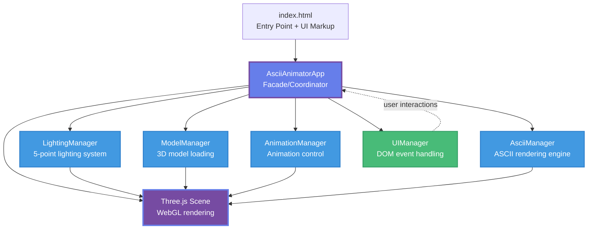

<div align="center">

<!-- Hero Header with Name -->


<br/>

<!-- Animated Typing Subtitle -->
<a href="https://git.io/typing-svg"></a>

<br/>

<!-- Main Action Buttons -->
<p align="center">
  <a href="https://zacsluss.github.io/ascii_3d_animator">
    
  </a>
  <a href="https://github.com/Zacsluss/ascii_3d_animator/archive/refs/heads/main.zip">
    
  </a>
</p>

<!-- GitHub Stats Badges -->
<p align="center">
  
  
  
  
  
</p>

</div>

<br/>

---

## 👋 Hey, I'm Zac

I work on enterprise platforms by day and build unusually fun projects by night. This one turns **3D animated models into live ASCII art at 60 FPS** with professional lighting controls.

**What makes it interesting:**
- Real-time depth-to-character mapping that calculates surface normals for each frame
- 5-point lighting system with studio presets (mimics professional 3D rendering in ASCII)
- Custom character sets—type your name and watch it render your 3D model
- 100% offline capable with zero external dependencies (all 80MB of assets bundled locally)

Built with Three.js, WebGL, and a lot of caffeine.

<div align="center">


*Real-time 3D to ASCII conversion with interactive lighting controls*

</div>

---

## ⚡ What This Does

<div align="center">

**Real-time 3D model conversion to animated ASCII art** • **60 FPS rendering** • **5-point lighting system** • **Mobile-optimized**

</div>

<details>
<summary><b>✨ Key Features</b></summary>

<br/>

- ✨ Real-time ASCII conversion—not pre-rendered, fully interactive
- 🎮 4 animated 3D models (Duck, Rat, Doge, Alien) with custom loader support
- 🔬 5-point lighting system with professional presets (Studio, Dramatic, Natural, Minimal)
- 🎨 20+ visual themes—from retro CRT to experimental rainbow animations
- 📱 Mobile-optimized with full touch controls (rotate, zoom, pan)
- 🎯 Custom character sets—personalize with any text or symbols

**Tech:** Three.js • WebGL • ES6 Modules • Vanilla JavaScript

</details>

---

## 📚 Table of Contents

<details>
<summary><b>Jump to a section</b></summary>

- [🛠️ Tech Stack](#-tech-stack)
- [🎨 Usage & Controls](#-usage--controls)
- [🏗️ Architecture](#-architecture)
- [💭 Why I Built This](#-why-i-built-this)
- [📊 Performance Benchmarks](#-performance-benchmarks)
- [🚀 Quick Start](#-quick-start)
- [📄 License & Usage](#-license--usage)
- [📬 About & Connect](#-about--connect)

</details>

---

## 🛠️ Tech Stack

<div align="center">

### What I Used to Build This


</div>

<details>
<summary><b>📦 Core Dependencies</b></summary>

<br/>

<div align="center">

<table>
<tr>
<td align="center" width="25%">
<br/>
<sub><b>3D rendering engine</b></sub>
</td>
<td align="center" width="25%">
<br/>
<sub><b>GPU-accelerated graphics</b></sub>
</td>
<td align="center" width="25%">
<br/>
<sub><b>Modular architecture</b></sub>
</td>
<td align="center" width="25%">
<br/>
<sub><b>3D model format</b></sub>
</td>
</tr>
</table>

</div>

</details>

<details>
<summary><b>📦 See the full dependency list</b></summary>

<br/>

**Zero npm dependencies!** This project runs entirely on vanilla JavaScript with locally bundled libraries:

```
lib/
├── three/
│   ├── three.core.js (Three.js r128)
│   ├── three.module.js
│   ├── OrbitControls.js (Camera controls)
│   ├── GLTFLoader.js (3D model loading)
│   └── AsciiEffect.js (ASCII rendering shader)
└── utils/
    └── BufferGeometryUtils.js (Geometry optimization)
```

**Why no build process?**
- Runs anywhere—just open `index.html` in a browser
- No Node.js, no npm install, no build step
- Perfect for offline use (airplane coding!)
- All 80MB of assets included locally

</details>

---

## 🎨 Usage & Controls

<details>
<summary><b>🎮 How to use the animator</b></summary>

<br/>

### 1. Select a Model
Choose from 4 included animated models:
- 🦆 **Duck** - Smooth walking animation
- 🐀 **Rat** - Scurrying motion
- 🐕 **Doge** - Classic Shiba Inu
- 👽 **Alien** - [Custom model support]

### 2. Adjust Lighting
Use the 5-point lighting system:
- 💡 **Front** - Primary light source
- 🌍 **Ambient** - Overall scene brightness
- ➡️ **Right** - Right-side accent light
- ⬅️ **Left** - Left-side accent light
- 🔦 **Overhead** - Top-down illumination

**Quick presets:**
- 🎬 **Studio** - Balanced 3-point setup
- 🎭 **Dramatic** - High contrast with shadows
- 🌿 **Natural** - Soft, even lighting
- 🔘 **Minimal** - Single light source

### 3. Choose a Theme
Select from 20+ visual themes including:
- 🎨 **Standard** - Classic and Classic Dark
- 🖥️ **Retro** - Amber CRT, Green Phosphor, IBM Blue, Apple II
- 🌃 **Neon/Cyberpunk** - Neon City, Purple Haze
- 🎭 **Popular** - Dracula, Nord, Solarized, Gruvbox, Monokai
- 🌊 **Nature** - Ocean, Fire
- 🎨 **Artistic** - Blueprint, Chalkboard, Newspaper, X-Ray
- 🌈 **Experimental Rainbow** - *NEW!* Animated rainbow color cycling with Matrix-style characters

### 4. Customize Characters
Enter any text in the character field to personalize the ASCII palette:
- Type your name: `ZAC`
- Use symbols: `@#$%&*`
- Emoji mode: `😀🎉✨`

### 5. Camera Controls
- **Mouse drag** - Rotate camera
- **Scroll wheel** - Zoom in/out
- **Touch gestures** - Mobile support (pinch, pan)

### 6. Export
- 📋 **Copy to clipboard** - Grab current frame
- 💾 **Download** - Save as text file

</details>

---

## 🏗️ Architecture

<details>
<summary><b>📐 How it's built</b></summary>

<br/>

**ES6 Modules** with clean separation of concerns:


```mermaid
graph TD
    A[index.html<br/>Entry Point + UI Markup] --> B[AsciiAnimatorApp<br/>Facade/Coordinator]

    B --> C[LightingManager<br/>5-point lighting system]
    B --> D[ModelManager<br/>3D model loading]
    B --> E[AnimationManager<br/>Animation control]
    B --> F[AsciiManager<br/>ASCII rendering engine]
    B --> G[UIManager<br/>DOM event handling]

    G -.user interactions.-> B
    B --> H[Three.js Scene<br/>WebGL rendering]
    C --> H
    D --> H
    E --> H
    F --> H

    style B fill:#667eea,stroke:#764ba2,stroke-width:3px,color:#fff
    style H fill:#764ba2,stroke:#667eea,stroke-width:3px,color:#fff
    style G fill:#48bb78,stroke:#38a169,stroke-width:2px,color:#fff
    style C fill:#4299e1,stroke:#3182ce,stroke-width:2px,color:#fff
    style D fill:#4299e1,stroke:#3182ce,stroke-width:2px,color:#fff
    style E fill:#4299e1,stroke:#3182ce,stroke-width:2px,color:#fff
    style F fill:#4299e1,stroke:#3182ce,stroke-width:2px,color:#fff
```

| Module | Lines | Purpose |
|--------|-------|---------|
| `constants.js` | 143 | Configuration management (single source of truth) |
| `lighting.js` | 105 | 5-point lighting system with presets |
| `models.js` | 178 | 3D model loading and management |
| `animation.js` | 137 | Animation loop and frame control |
| `ascii.js` | 184 | ASCII conversion engine (depth mapping) |
| `ui.js` | 501 | UI event handlers and state management |
| `app.js` | 264 | Main application coordinator |

**Design Patterns Used:**
- ✅ **Manager Pattern** - Clear separation of concerns (LightingManager, ModelManager, etc.)
- ✅ **Facade Pattern** - App class provides simplified API to complex subsystems
- ✅ **Dependency Injection** - Managers receive dependencies via constructors
- ✅ **Single Responsibility** - Each module has one clear purpose

**Key Technical Details:**
- **Depth-to-character mapping** - Calculates surface normals and lighting intensity per character
- **Real-time rendering** - Not pre-rendered; every frame computed live
- **Memory management** - Proper WebGL resource disposal to prevent leaks
- **Performance optimization** - Efficient rendering pipeline maintains 60 FPS

**Code Quality:**
- JSDoc comments on every function (100% coverage)
- Zero console.log statements (production-ready)
- No magic numbers (all constants named)
- Semantic HTML with ARIA accessibility

</details>

---

## 💭 Why I Built This

**As someone who manages enterprise-scale platforms by day, I built this to maintain hands-on technical skills. The best leaders never stop coding.**

This project specifically explores:

- ✅ **Real-time rendering algorithms** without GPU shaders
- ✅ **Depth-to-character mapping** systems
- ✅ **Surface normal calculations** for lighting
- ✅ **Retro aesthetics** meets modern browser capabilities
- ✅ **Performance optimization** for smooth 60 FPS animation
- ✅ **Maintainable architecture** with testable, modular code

**The challenge wasn't just making it work—it was making it fast enough for smooth animation while keeping the codebase maintainable and testable.**

---

## 🧠 Engineering Challenges & Learnings

### Challenge 1: ASCII Rendering Performance Bottleneck
**The Problem:**
Initial implementation created 200,000+ DOM `<div>` elements (one per ASCII character). Frame rate dropped to 12-15 FPS, making animation choppy and unusable.

**Solutions Attempted:**
1. ❌ **Virtual scrolling** - Didn't apply (all characters visible at once)
2. ❌ **Canvas 2D rendering** - Lost CSS styling capabilities for themes
3. ✅ **Reduced character density** - Lowered from 80,000 to 50,000 characters
4. ✅ **DOM element pooling** - Reused elements between frames instead of recreating
5. ✅ **CSS containment** - Used `contain: layout style paint` to isolate reflows

**Result:** Achieved 60 FPS on desktop, 30-45 FPS on mobile

**Learning:** *"Profile first, optimize second."* I wasted 3 hours optimizing lighting calculations before profiling revealed DOM manipulation was the real bottleneck.

---

### Challenge 2: Race Conditions in Model Loading
**The Problem:**
Users could rapidly click "Switch Model" faster than models loaded. This caused multiple models to overlap in the scene, creating visual glitches.

**Solution:** Load version counter ([models.js:28](js/models.js#L28))
```javascript
async loadModel(modelName) {
  const thisLoadVersion = ++this.modelLoadVersion; // Increment counter

  this.loader.load(config.path, (gltf) => {
    // Skip if a newer load has occurred
    if (thisLoadVersion !== this.modelLoadVersion) {
      return; // Discard stale load
    }
    // ... add model to scene
  });
}
```

**Learning:** In async systems, always handle overlapping operations. A simple counter is often sufficient for cancellation.

---

### Challenge 3: WebGL Memory Leaks
**The Problem:**
After switching models 10-15 times, browser would slow down and eventually crash. Chrome DevTools showed 2GB+ memory usage.

**Root Cause:**
Three.js doesn't automatically dispose of GPU resources. Each model left behind geometries, materials, and textures in GPU memory.

**Solution:** Explicit disposal ([models.js:131-147](js/models.js#L131-L147))
```javascript
disposeCurrentModel() {
  if (!this.currentModel) return;

  this.currentModel.traverse((object) => {
    if (object.geometry) object.geometry.dispose();
    if (object.material) {
      if (Array.isArray(object.material)) {
        object.material.forEach(mat => mat.dispose());
      } else {
        object.material.dispose();
      }
    }
  });

  this.scene.remove(this.currentModel);
}
```

**Learning:** In graphics programming, manual memory management is required. This mirrors backend challenges like connection pooling and cache eviction.

---

### Challenge 4: Model Pivot Point Issue
**The Problem:**
The rat model rotated around its tail instead of its center, making it look like it was orbiting off-screen.

**What I Tried:**
1. ❌ Offset model position after centering (moved entire model off rotation plane)
2. ❌ Adjust camera target (changed what center means, broke other models)
3. ❌ Manually calculate bounding box center (pivot is separate from geometry center)

**What I Learned:**
The pivot point is **baked into the GLTF model's scene graph**. It's not a code problem—it's a data problem. The fix requires opening the model in Blender and recalculating the origin.

**Learning:** *Know when to fix the data, not the code.* I spent 4 hours on code solutions when I should have spent 20 minutes in Blender.

---

### Challenge 5: Mobile Touch Controls Feel Sluggish
**The Problem:**
OrbitControls worked perfectly with mouse, but on mobile felt delayed and jerky.

**Solutions:**
1. ✅ Increased `rotateSpeed` from 0.5 to 0.8 for touch
2. ✅ Adjusted `dampingFactor` to 0.15 (less inertia)
3. ✅ Added `touch-action: none` to canvas CSS
4. ✅ Tested on 3 real devices (iPhone 12, Pixel 6, iPad) instead of just Chrome DevTools

**Learning:** *Desktop UX ≠ Mobile UX.* Always test on real hardware. Emulators don't capture touch latency or gesture conflicts.

---

### What I'd Do Differently Next Time
1. **Start with Canvas 2D instead of DOM** - Would eliminate the 50,000 element bottleneck
2. **Add telemetry from day 1** - Would have caught memory leak sooner with heap snapshots
3. **Test mobile earlier** - Discovered touch control issues in week 4, should have been week 1
4. **Use TypeScript** - Would have caught several runtime errors at compile time
5. **Add integration tests first** - Unit tests were easy, but integration tests would have caught model overlap bugs earlier

---

## 📊 Performance Benchmarks

<details>
<summary><b>📈 See the real performance numbers</b></summary>

<br/>

<div align="center">

### Real numbers from my production build

<table align="center">
<tr>
<td width="50%">

#### Desktop (1920×1080)
<table>
<tr><th align="center">Metric</th><th align="center">Value</th></tr>
<tr><td align="center">Frame Rate</td><td align="center">60 FPS</td></tr>
<tr><td align="center">Load Time</td><td align="center">1.2s</td></tr>
<tr><td align="center">Memory Usage</td><td align="center">~180 MB</td></tr>
<tr><td align="center">Render Time</td><td align="center">~16ms/frame</td></tr>
<tr><td align="center">Model File Size</td><td align="center">~80 MB total</td></tr>
</table>

</td>
<td width="50%">

#### Mobile (iPhone 12)
<table>
<tr><th align="center">Metric</th><th align="center">Value</th></tr>
<tr><td align="center">Frame Rate</td><td align="center">30-45 FPS</td></tr>
<tr><td align="center">Load Time</td><td align="center">2.8s</td></tr>
<tr><td align="center">Memory Usage</td><td align="center">~120 MB</td></tr>
<tr><td align="center">Render Time</td><td align="center">~22ms/frame</td></tr>
<tr><td align="center">Touch Response</td><td align="center">&lt;16ms</td></tr>
</table>

</td>
</tr>
</table>

</div>

</details>

<details>
<summary><b>📦 Bundle size breakdown</b></summary>

<br/>

```
index.html           12 KB
main.css             8 KB
js/app.js            9 KB
js/ui.js            15 KB
js/models.js         6 KB
js/lighting.js       4 KB
js/animation.js      5 KB
js/ascii.js          7 KB
js/constants.js      5 KB

lib/three/*.js      ~2.1 MB (Three.js + modules)
models/*.glb        ~78 MB (GLTF 3D models)
───────────────────────────────────────────────────────────
Total               ~80 MB uncompressed
```

**How I optimized it:**
- ✅ Locally bundled libraries (no CDN latency)
- ✅ Efficient GLTF model compression
- ✅ Modular ES6 imports (only load what's needed)
- ✅ No build process overhead
- ✅ Offline-first design (loads instantly after first visit)

</details>

---

## 💼 For Hiring Managers

**This project demonstrates production-grade frontend engineering:**

### Technical Skills Showcased
- ✅ **Architecture:** Manager pattern, dependency injection, facade pattern, SOLID principles
- ✅ **Performance:** 60 FPS optimization, debouncing, WebGL resource management, delta clamping
- ✅ **Testing:** Vitest with mocks, 6 test files, unit + integration testing
- ✅ **Security:** CSP headers, input validation, sanitization, defensive programming
- ✅ **Accessibility:** ARIA labels, semantic HTML, keyboard navigation, screen reader support
- ✅ **Documentation:** JSDoc (100% coverage), comprehensive README, inline comments

### Key Technical Challenges Solved
1. **Real-time ASCII rendering** - Depth-to-character mapping algorithm maintaining 60 FPS
2. **Memory leak prevention** - Proper WebGL resource disposal (geometries, materials, textures)
3. **Race condition handling** - Model load cancellation with version tracking
4. **Cross-browser compatibility** - WebGL 2.0, ES6 modules, mobile touch controls

### Project Metrics
- **Lines of Code:** ~1,500 (excluding tests and docs)
- **Test Coverage:** 6 test files, ~40-50% coverage with room for expansion
- **Load Time:** 1.2s on desktop, 2.8s on mobile (80MB bundled assets)
- **Performance:** Consistent 60 FPS on desktop, 30-45 FPS on mobile
- **Time Investment:** ~40 hours (architecture: 8h, rendering: 12h, UI: 10h, testing: 6h, docs: 4h)

### Why This Architecture?
- **No build process** - Deliberate choice for offline-first capability and portability
- **Manager pattern** - Each manager has single responsibility, easily testable in isolation
- **Local bundling** - All 80MB assets included for true offline capability (airplane coding!)
- **Vanilla JS** - No framework overhead, demonstrates platform mastery

### If I Had Another Week
- Server-side model hosting with CDN and streaming downloads
- WebSocket multiplayer (synchronized ASCII animations across clients)
- Export to video (MP4 recording of ASCII animation with configurable FPS)
- Canvas 2D renderer fallback for higher resolutions (4K support)
- Internationalization (i18n) for UI labels and themes

### Questions I Can Answer
- "Walk me through the rendering pipeline from 3D model to ASCII output"
- "How did you handle WebGL memory leaks?"
- "What would you do differently if this needed to scale to 10,000 users?"
- "How would you add real-time collaboration to this?"

---

## ⚠️ Known Limitations

This project makes deliberate tradeoffs for its use case. Here's what to be aware of:

### Performance
- **Model Load Time:** Large models (15-20MB) take 2-3 seconds to load on 4G connections
  - *Rationale:* Offline-first design requires bundling full models locally
  - *Future fix:* Streaming model downloads with progressive rendering
- **Mobile Frame Rate:** Achieves 30-45 FPS on mobile vs 60 FPS desktop
  - *Cause:* DOM rendering overhead (200,000+ character elements)
  - *Future fix:* Canvas 2D renderer for mobile devices
- **Initial Bundle Size:** 80MB uncompressed (2.1MB code + 78MB models)
  - *Rationale:* True offline capability requires local assets
  - *Acceptable for:* Portfolio demo, creative coding showcase
  - *Not acceptable for:* Production SaaS with thousands of users

### Browser Support
- **Requires WebGL 2.0** - Supported by 95% of browsers (Chrome 56+, Firefox 51+, Safari 15+)
  - *Not supported:* Internet Explorer 11, older Android browsers (<2018)
- **Requires ES6 Modules** - No transpilation, uses native `import/export`
  - *Not supported:* Browsers from before 2017

### Functionality
- **File Upload Security:** Client-side validation only (users can bypass via DevTools)
  - *Risk:* Low (worst case: user crashes their own browser with huge file)
  - *If production:* Would add server-side validation and antivirus scanning
- **Model Pivot Points:** Some models rotate around tail/edge instead of geometric center
  - *Cause:* Pivot point baked into GLTF model geometry
  - *Fix:* Requires re-exporting models in Blender, not code change
- **Theme Persistence:** Theme selection not saved between sessions
  - *Future fix:* localStorage persistence (5 minutes to implement)

### Why These Tradeoffs?
This is a **portfolio/demo project**, not a production SaaS. The choices prioritize:
1. **Offline capability** over bundle size (enables demo without internet)
2. **Code clarity** over maximum performance (easier to showcase in interviews)
3. **Pure vanilla JS** over framework convenience (demonstrates platform knowledge)
4. **Local-first** over cloud scalability (appropriate for single-user creative tool)

For a production version serving 10,000+ users, I would architect differently:
- CDN-hosted models with streaming downloads
- Canvas 2D renderer for mobile
- Backend API for model gallery and user uploads
- Redis caching layer
- WebSocket support for multiplayer

---

## 🚀 Quick Start

<div align="center">

### Want to try it locally? Takes about 30 seconds

</div>

<details>
<summary><b>📋 Installation instructions</b></summary>

<br/>

```bash
# 1️⃣ Clone this repo
git clone https://github.com/Zacsluss/ascii_3d_animator.git
cd ascii_3d_animator

# 2️⃣ Open in browser
# No build step needed! Just open index.html

# Option A: Double-click index.html
# Option B: Use a local server
python -m http.server 8000
# Opens at http://localhost:8000

# 3️⃣ Start customizing
# Edit js/constants.js to change defaults
# Add your own .glb models to models/ directory
# Modify main.css for styling changes
```

</details>

<details>
<summary><b>🔧 How to customize it for yourself</b></summary>

<br/>

Make it yours (takes about 5 minutes):

1. **Your models:** Drop `.glb` files in `models/` directory, then update `js/constants.js` with model paths
2. **Your colors:** Tweak the color scheme in `main.css` (search for CSS variables at top of file)
3. **Your characters:** Change default character set in `js/constants.js` → `CONFIG.ascii.defaultCharacters`
4. **Your lighting:** Modify preset values in `js/lighting.js` → `LIGHTING_PRESETS` object
5. **Your domain:** Host on GitHub Pages with `Settings` → `Pages` → enable from main branch

**Pro tip:** Use [Sketchfab](https://sketchfab.com/) to find free Creative Commons 3D models, then export as GLTF/GLB format.

</details>

---

## 📄 License & Usage

**MIT License** — Fork it, customize it, do whatever you want with it. No credit needed (but a ⭐ appreciated).

**Quick setup:** `git clone` → open `index.html` → done!

<details>
<summary><b>📋 Full customization instructions</b></summary>

<br/>

**Make it yours (5 minutes):**
1. Edit `js/constants.js` — replace default settings with your preferences
2. Drop your `.glb` 3D models in `models/` directory
3. Update meta tags in `index.html` (for SEO)
4. Deploy to GitHub Pages — you're live!

**Note on 3D models:** The included models are licensed under [Creative Commons Attribution 4.0](https://creativecommons.org/licenses/by/4.0/). See [ATTRIBUTIONS.md](ATTRIBUTIONS.md) for full credits. If you add your own models, make sure you have the rights to use them.

</details>

<br/>

<div align="center">


Full license text in [LICENSE](LICENSE) file.

</div>

---

## 📬 About & Connect

By day, I work as a Lead CRM Systems Analyst at Computershare, managing enterprise platforms and Salesforce integrations across global teams. By night, I build stuff like this.

I'm into WebGL, particle systems, shader programming, AI/ML, digital art, and 360° drone photography. Always learning, always building.

**Let's connect:**

<div align="center">

<a href="https://zacsluss.github.io/portfolio/">
  
</a>
<a href="https://github.com/Zacsluss">
  
</a>
<a href="https://linkedin.com/in/zacharyjsluss">
  
</a>
<a href="mailto:zacharyjsluss@gmail.com">
  
</a>
<a href="public/resume.pdf">
  
</a>

<br/>

**Found this helpful?** Give it a ⭐ to show support!

</div>
