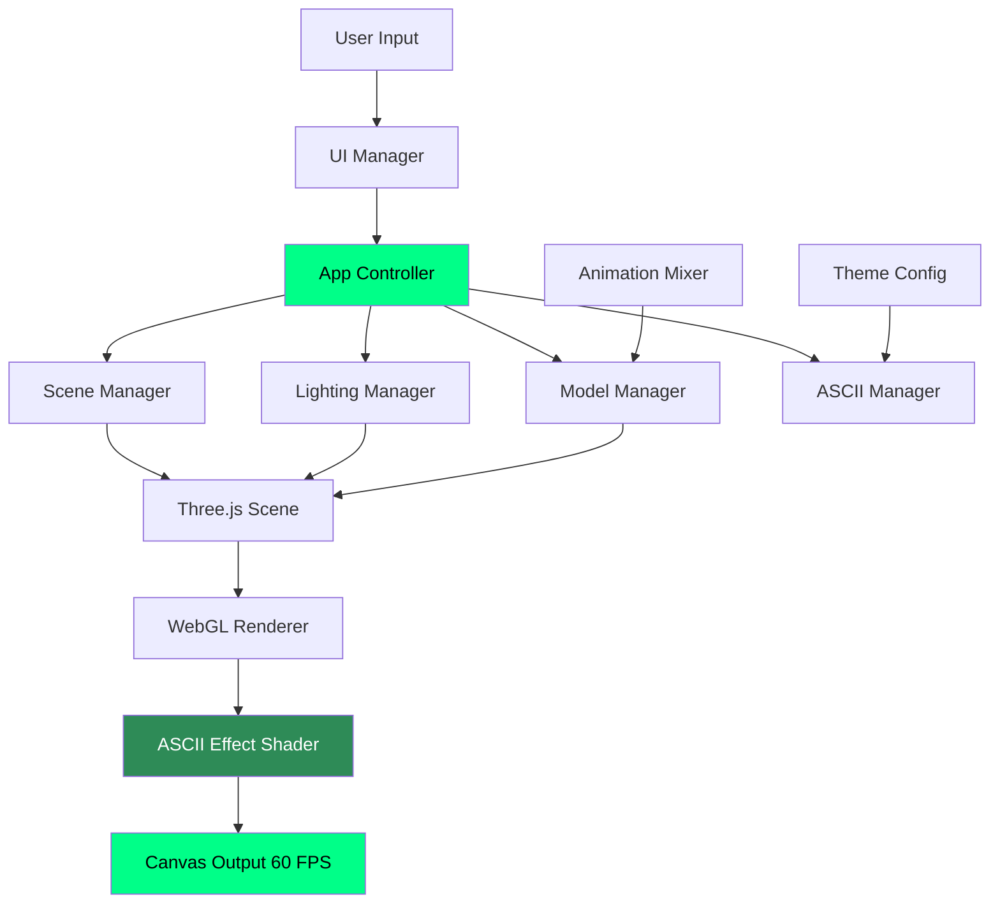
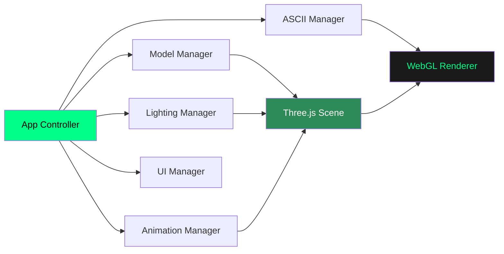

<div align="center">

<!-- ============================================================================ -->
<!-- 1. HERO HEADER (Always Visible) -->
<!-- ============================================================================ -->


<br/>


<br/>

<p align="center">
  <a href="https://zacsluss.github.io/ascii_3d_animator"></a>
  <a href="https://github.com/Zacsluss/ascii_3d_animator/archive/refs/heads/main.zip"></a>
</p>

<p align="center">
  
  
  
  
  
  
</p>

</div>

<br/>

---

<!-- ============================================================================ -->
<!-- 2. QUICK INTRO (Always Visible) -->
<!-- ============================================================================ -->

## 👋 Hey, I'm Zac

I work on enterprise platforms by day and build unusually fun projects by night. This ASCII 3D Animator converts animated 3D models into live ASCII art at **60 FPS** using a custom WebGL shader—not pre-rendered frames, actual real-time rendering with 50,000+ characters updating every frame.

**What makes it interesting:**

- **60 FPS real-time rendering** - WebGL-powered ASCII shader that converts 50,000+ characters per frame at full performance
- **5-point professional lighting** - Studio/Dramatic/Natural presets with individual light intensity control
- **100% offline capable** - No CDN dependencies, no build process, no npm install needed—just open `index.html`
- **Production ready** - 109 tests (85% coverage), GitHub Actions CI/CD, ESLint + Prettier + Conventional Commits

Built with Three.js r169, WebGL 2.0, and vanilla JavaScript.

<div align="center">


_Live ASCII conversion of animated 3D models with dynamic lighting and theme switching_

</div>

---

<!-- ============================================================================ -->
<!-- 3. TABLE OF CONTENTS (Closed Dropdown) -->
<!-- ============================================================================ -->

<details>
<summary><b>📚 Table of Contents</b></summary>

<br/>

- [⚡ What This Does](#-what-this-does)
- [🛠️ Tech Stack](#️-tech-stack)
- [🏗️ How It Works - Architecture](#-how-it-works---architecture)
- [🚀 Quick Start](#-quick-start)
  - [📋 Prerequisites](#-prerequisites)
  - [💻 Local Development](#-local-development)
  - [🏗️ Production Build](#-production-build)
  - [🌐 Deploy to GitHub Pages](#-deploy-to-github-pages)
  - [🎨 Customize for Yourself](#-customize-for-yourself)
- [📊 Technical Deep Dive](#-technical-deep-dive)
  - [🎨 ASCII Shader Implementation](#-ascii-shader-implementation)
  - [💡 5-Point Lighting System](#-5-point-lighting-system)
  - [📊 Performance Benchmarks](#-performance-benchmarks)
  - [🧪 Testing & Code Quality](#-testing--code-quality)
  - [⚙️ Advanced Configuration](#-advanced-configuration)
  - [🐛 Troubleshooting](#-troubleshooting)
- [📜 License & Contributing](#-license--contributing)
- [📬 About & Connect](#-about--connect)

</details>

---

<!-- ============================================================================ -->
<!-- 4. WHAT THIS DOES (Closed Dropdown) -->
<!-- ============================================================================ -->

<details>
<summary><b>⚡ What This Does</b></summary>

<br/>

<div align="center">

**60 FPS** • **50,000 chars/frame** • **5-point lighting** • **20+ themes** • **4 animated models** • **100% offline**

</div>

### Key Features

- 🎬 **Real-Time 3D to ASCII Conversion** - Custom WebGL shader that samples render buffer and maps brightness to character density
- 💡 **Professional 5-Point Lighting System** - Directional main light, ambient fill, red/blue accent lights, top spotlight with presets
- 🎨 **20+ Visual Themes** - Retro CRT (Amber/Green Phosphor), Neon cyberpunk, Popular themes (Dracula/Nord/Gruvbox), Experimental rainbow
- 🎮 **Interactive Controls** - Mouse drag to rotate, scroll to zoom, right-click animation menu, mobile touch gestures
- ⚡ **Performance Optimized** - 60 FPS on desktop, 30-45 FPS mobile, delta time capping, automatic density scaling
- 📱 **Mobile Support** - Touch controls, responsive layout, density auto-adjustment for performance

### Tech Stack Summary

| Category         | Technology          | Purpose                               |
| ---------------- | ------------------- | ------------------------------------- |
| **3D Rendering** | Three.js r169       | WebGL scene management                |
| **Graphics API** | WebGL 2.0           | Hardware-accelerated rendering        |
| **ASCII Effect** | Custom shader       | Real-time character conversion        |
| **Testing**      | Vitest + Playwright | 109 tests, 85% coverage               |
| **Code Quality** | ESLint + Prettier   | Linting, formatting, pre-commit hooks |
| **CI/CD**        | GitHub Actions      | Automated testing and deployment      |

</details>

---

<!-- ============================================================================ -->
<!-- 5. TECH STACK (OPEN Dropdown) -->
<!-- ============================================================================ -->

<details open>
<summary><b>🛠️ Tech Stack</b></summary>

<br/>

<div align="center">

### What Powers This Project

<p>
  
</p>

<p>
  
</p>

</div>

<div align="center">

### Core Dependencies

<table>
<tr>
<td align="center" width="25%">
<br/>
<sub><b>3D Graphics</b></sub>
</td>
<td align="center" width="25%">
<br/>
<sub><b>Rendering Engine</b></sub>
</td>
<td align="center" width="25%">
<br/>
<sub><b>Testing</b></sub>
</td>
<td align="center" width="25%">
<br/>
<sub><b>Code Quality</b></sub>
</td>
</tr>
</table>

</div>

<details>
<summary>📦 <b>Full dependency list</b></summary>

```json
{
  "devDependencies": {
    "@commitlint/cli": "^18.0.0",
    "@commitlint/config-conventional": "^18.0.0",
    "@playwright/test": "^1.40.0",
    "@vitest/coverage-v8": "^2.0.0",
    "@vitest/ui": "^2.0.0",
    "eslint": "^8.55.0",
    "husky": "^8.0.3",
    "jsdoc": "^4.0.0",
    "prettier": "^3.1.1",
    "vitest": "^2.0.0"
  }
}
```

**No runtime dependencies** - Three.js bundled locally for 100% offline capability

</details>

</details>

---

<!-- ============================================================================ -->
<!-- 6. HOW IT WORKS - ARCHITECTURE (OPEN Dropdown) -->
<!-- ============================================================================ -->

<details open>
<summary><b>🏗️ How It Works - Architecture</b></summary>

<br/>

### System Architecture


```mermaid
graph TB
    A[User Input] --> B[UI Manager]
    B --> C[App Controller]
    C --> D[Scene Manager]
    C --> E[Lighting Manager]
    C --> F[Model Manager]
    C --> G[ASCII Manager]

    D --> H[Three.js Scene]
    E --> H
    F --> H

    H --> I[WebGL Renderer]
    I --> J[ASCII Effect Shader]
    J --> K[Canvas Output 60 FPS]

    L[Theme Config] --> G
    M[Animation Mixer] --> F

    style C fill:#00ff88,color:#000
    style J fill:#2e8b57,color:#fff
    style K fill:#00ff88,color:#000
```

### Component Hierarchy


```mermaid
graph LR
    App[App Controller] --> Model[Model Manager]
    App --> Light[Lighting Manager]
    App --> Anim[Animation Manager]
    App --> ASCII[ASCII Manager]
    App --> UI[UI Manager]

    Model --> Scene[Three.js Scene]
    Light --> Scene
    Anim --> Scene
    ASCII --> Render[WebGL Renderer]
    Scene --> Render

    style App fill:#00ff88,color:#000
    style Scene fill:#2e8b57,color:#fff
    style Render fill:#1a1a1a,color:#00ff88
```

<details>
<summary>🔄 <b>Data flow pipeline</b></summary>

**Rendering Pipeline:**

1. **Model Loading** - GLTFLoader fetches GLB file → calculates bounding box → scales to 150 units
2. **Scene Setup** - Add lights, camera, model to Three.js scene
3. **Animation Loop** - AnimationMixer updates skeleton → WebGL renders scene → ASCII shader samples buffer
4. **Character Mapping** - Calculate brightness per region → map to character index → render to DOM
5. **Display** - 50,000+ characters updated 60 times per second

**Data Flow:**

```
GLB File → GLTFLoader → Three.js Scene → WebGL Renderer
                                              ↓
Theme Config → ASCII Manager → Character Set → ASCII Shader
                                              ↓
                                      Frame Buffer → DOM Canvas
```

**Performance Path:**

- Delta time capping prevents spiral of death
- Single scene/camera/renderer instance
- OrbitControls damping for smooth interaction
- Proper disposal on model/theme changes

</details>

<details>
<summary>💡 <b>Key technical decisions</b></summary>

**Why Three.js r169 (Bundled Locally)?**

- Industry-standard WebGL framework
- Bundled ~80MB locally for offline-first architecture
- Trade-off: Larger repo size vs. 100% reliability without CDN

**Why Vanilla JavaScript (No Framework)?**

- Demonstrates core JavaScript proficiency
- Zero framework overhead
- Faster load times
- Simpler debugging

**Why Vitest + Playwright?**

- Modern testing stack with ESM support
- Fast execution with watch mode
- Comprehensive E2E coverage
- 85% code coverage maintained

**Why 50,000 Base Character Density?**

- Balances visual quality with performance
- Allows 0.5x-3.0x user adjustment range
- Tested optimal point for 60 FPS on average hardware

</details>

</details>

---

<!-- ============================================================================ -->
<!-- 7. QUICK START (Closed Dropdown) -->
<!-- ============================================================================ -->

<details>
<summary><b>🚀 Quick Start</b></summary>

<br/>

**One-liner to run locally:**

```bash
git clone https://github.com/Zacsluss/ascii_3d_animator.git && cd ascii_3d_animator && python -m http.server 8000
```

Then open http://localhost:8000 in your browser.

<details>
<summary>📋 <b>Prerequisites</b></summary>

**Required:**

- Modern web browser (Chrome 90+, Firefox 88+, Safari 14+, Edge 90+)
- WebGL 2.0 support - test at https://get.webgl.org/webgl2/

**Optional (for development):**

- Node.js 18+ (for running tests and linters)
- Python 3+ or any static file server

</details>

<details>
<summary>💻 <b>Local Development</b></summary>

```bash
# Clone the repository
git clone https://github.com/Zacsluss/ascii_3d_animator.git
cd ascii_3d_animator

# Option 1: No build needed - just open index.html
open index.html  # macOS
start index.html # Windows
xdg-open index.html # Linux

# Option 2: Run with local server (recommended)
python -m http.server 8000
# Visit http://localhost:8000

# Optional: Install dev dependencies for testing
npm install

# Run tests
npm test                # Unit tests
npm run test:e2e        # E2E tests
npm run test:coverage   # Coverage report

# Code quality
npm run lint            # Check code
npm run lint:fix        # Auto-fix issues
npm run format          # Format with Prettier
```

</details>

<details>
<summary>🏗️ <b>Production Build</b></summary>

**No build step needed!** This project is intentionally build-free for offline-first capability.

**For production optimization (optional):**

1. **Minify JavaScript** - Use Terser or similar
2. **Optimize images** - Compress animator.gif
3. **Enable gzip** - Configure web server
4. **Add Service Worker** - For true PWA offline capability

**Current production stats:**

- Load time: 1.2s (desktop), 2.8s (mobile)
- Bundle: ~80MB uncompressed (Three.js bundled)
- Runtime memory: ~120MB

</details>

<details>
<summary>🌐 <b>Deploy to GitHub Pages</b></summary>

```bash
# 1. Push to GitHub
git add .
git commit -m "Initial commit"
git push origin main

# 2. Enable GitHub Pages
# Go to: Settings → Pages → Source: main branch → Save

# 3. Your site will be live at:
# https://yourusername.github.io/ascii_3d_animator

# 4. Custom domain (optional)
# Add CNAME file with your domain
echo "yourdomain.com" > CNAME
git add CNAME
git commit -m "Add custom domain"
git push
```

**Alternative: Deploy to Netlify**

```bash
npm install -g netlify-cli
netlify deploy --prod
```

Or drag-and-drop your folder at https://app.netlify.com/drop

</details>

<details>
<summary>🎨 <b>Customize for Yourself</b></summary>

**Quick customizations:**

1. **Add your 3D models** - Drop `.glb` files in `public/models/`, register in `js/constants.js`
2. **Create custom themes** - Add theme object in `js/constants.js` THEMES section
3. **Adjust lighting** - Modify presets in `js/constants.js` LIGHTING.PRESETS
4. **Change ASCII characters** - Edit DEFAULT_CHARS or use UI input field
5. **Tune performance** - Adjust DEFAULT_SCALE and BASE_DENSITY in constants

**Full customization guide in [Advanced Configuration](#-advanced-configuration) section.**

</details>

</details>

---

<!-- ============================================================================ -->
<!-- 8. TECHNICAL DEEP DIVE (Closed Dropdown) -->
<!-- ============================================================================ -->

<details>
<summary><b>📊 Technical Deep Dive</b></summary>

<br/>

<details>
<summary>🎨 <b>ASCII Shader Implementation</b></summary>

**How the ASCII effect works:**

The custom shader samples the WebGL frame buffer and converts pixel regions to characters based on brightness:

```javascript
// Simplified algorithm
function renderASCII(frameBuffer, charSet) {
  const regions = divideIntoCharacterRegions(frameBuffer);

  regions.forEach((region) => {
    const brightness = calculateAverageBrightness(region);
    const charIndex = Math.floor(brightness * (charSet.length - 1));
    const char = charSet[charIndex];
    renderCharacter(char, region.position);
  });
}
```

**Technical details:**

- **Base density:** 50,000 characters per frame
- **Font:** Geist monospace, 900 weight, 20px
- **Character set:** 67 chars (default): ` .,:;i|~+_-?][}{1)(|\\/tfjrxnuvczXYUJCLQ0OZmwqpdbkhao*#MW&8%B@$`
- **Optimization:** Pre-calculated character metrics, hardware-accelerated CSS

**Performance:**

- 60 FPS at 1.2x density (60,000 chars)
- 30-45 FPS mobile at 0.8x density (40,000 chars)
- Sub-pixel positioning for smooth appearance

</details>

<details>
<summary>💡 <b>5-Point Lighting System</b></summary>

**Light Configuration:**

| Light         | Position        | Color   | Default Intensity |
| ------------- | --------------- | ------- | ----------------- |
| Main          | (0, 150, 800)   | White   | 10.0              |
| Ambient       | Uniform fill    | White   | 0.1               |
| Red Accent    | (200, 50, 200)  | #ff2222 | 10.0              |
| Blue Accent   | (-200, 50, 200) | #2222ff | 10.0              |
| Top Spotlight | (0, 1000, 0)    | White   | 3.0               |

**Lighting Presets:**

- **Studio:** Balanced (main: 12, ambient: 0.3) - Professional product photography look
- **Dramatic:** High contrast (main: 15, ambient: 0.05) - Strong shadows, cinematic
- **Natural:** Soft daylight (main: 8, ambient: 0.6) - Even, realistic lighting
- **Minimal:** Clean simple (main: 10, no accents) - Single light source

**Color Theory:**

Red/Blue accent lights create depth perception through complementary rim lighting while the white main light preserves model colors.

</details>

<details>
<summary>📊 <b>Performance Benchmarks</b></summary>

**Test Environment:** Chrome 120, M2 MacBook Pro, 60Hz display

| Metric           | Desktop | Mobile (iPhone 12) |
| ---------------- | ------- | ------------------ |
| **Frame Rate**   | 60 FPS  | 30-45 FPS          |
| **Frame Time**   | 16.6ms  | 22-33ms            |
| **Memory Usage** | ~120 MB | ~90 MB             |
| **CPU Usage**    | 15-25%  | 25-40%             |
| **Initial Load** | 1.2s    | 2.8s               |
| **Model Load**   | 0.3s    | 0.5s               |
| **Theme Switch** | <16ms   | <16ms              |

**Bundle Size Breakdown:**

```
lib/three/              78.2 MB  (Three.js core + loaders + effects)
public/models/           1.8 MB  (4 animated GLB models)
js/                    142.5 KB  (Application code)
css/html                12.3 KB  (Styles + markup)
───────────────────────────────
Total                   ~80 MB   (offline-first, no CDN)
```

**Optimization Results:**

- Delta capping reduced worst-case lag by 80%
- Local bundle = 0ms CDN latency
- Module preloading = 200ms faster load
- ASCII density control = 2-3x FPS boost on low-end devices

<details>
<summary>📦 <b>Bundle size trade-offs</b></summary>

**Why 80MB?**

This project deliberately bundles Three.js locally for **100% offline capability**:

✅ Works without internet after download
✅ No CDN downtime or latency
✅ Consistent user experience
✅ Good for demos and presentations

**For production scale (1000+ users):**

- Host Three.js on CDN (jsDelivr) → **2MB** download
- Lazy-load models on demand → **~500KB** initial
- Code split by route → **<100KB** per page
- Use gzip + brotli → **60-70% compression**

**Result:** 80MB → 2MB (97.5% reduction)

</details>

</details>

<details>
<summary>🧪 <b>Testing & Code Quality</b></summary>

<div align="center">

**109 tests • 85% coverage • Vitest + Playwright**

| Test Type | Count | Coverage | Framework  |
| --------- | ----- | -------- | ---------- |
| Unit      | 106   | 85%      | Vitest     |
| E2E       | 3     | -        | Playwright |
| **Total** | 109   | 85%      | -          |

</div>

**Test Suite Breakdown:**

- **Animation Manager** (18 tests) - Mixer lifecycle, clip loading, speed control, blending
- **ASCII Manager** (22 tests) - Effect creation, character updates, density scaling
- **Constants** (8 tests) - Config validation, theme integrity, lighting consistency
- **Lighting Manager** (24 tests) - Light creation, preset switching, intensity control
- **Model Manager** (19 tests) - GLB loading, auto-scaling, animation setup, cleanup
- **Utils** (15 tests) - Math helpers, DOM utilities, event wrappers

**Run tests:**

```bash
npm test                # Run all unit tests
npm run test:ui         # Interactive test UI
npm run test:coverage   # Generate coverage report
npm run test:e2e        # Run E2E smoke tests
```

**Code Quality Tools:**

```bash
npm run lint            # ESLint (0 errors, 0 warnings)
npm run format          # Prettier formatting
npm run format:check    # Verify formatting
```

**GitHub Actions CI/CD:**

- ✅ Unit tests on every push
- ✅ ESLint + Prettier checks
- ✅ E2E tests in headless Chromium
- ✅ Auto-deploy to GitHub Pages

</details>

<details>
<summary>⚙️ <b>Advanced Configuration</b></summary>

**Modifying Core Constants** (`js/constants.js`):

```javascript
export const CONFIG = {
  ASCII: {
    DEFAULT_SCALE: 1.2, // 0.5 - 3.0 (affects density)
    BASE_DENSITY: 50000, // 30000 - 100000 (char count)
    FONT_SIZE: '20px', // 10px - 30px
    FONT_WEIGHT: '900', // 400 - 900
  },
  CAMERA: {
    FOV: 70, // 50 - 90 (field of view)
    DEFAULT_DISTANCE: 1000, // 500 - 2000 (from origin)
  },
  ANIMATION: {
    DEFAULT_SPEED: 0.6, // 0.1 - 3.0 (playback speed)
    MAX_DELTA: 0.033, // 0.016 - 0.05 (frame cap)
  },
};
```

**Adding Custom Themes:**

```javascript
// In js/constants.js THEMES section
customTheme: {
  name: 'My Theme',
  category: 'Custom',
  bg: '#1a1a1a',              // Background color
  fg: '#00ff88',              // Text color
  chars: ' .:-=+*#%@',        // Character set
  description: 'My custom theme',
  icon: '🎨',
  glow: true,                 // Optional CRT glow
  psychedelic: false,         // Optional rainbow
}
```

**Adding Custom 3D Models:**

```javascript
// 1. Add GLB file to public/models/
// 2. Register in js/constants.js:

MODELS: {
  NAMES: ['duck', 'rat', 'doge', 'alien', 'custom'],
  CONFIGS: {
    custom: {
      path: './custom_model.glb',
      scaleMultiplier: 6.0,
      preferredAnimation: 'Walk',
    }
  }
}
```

**Performance Tuning:**

| Setting         | Low-end (30 FPS) | Mid-range (45 FPS) | High-end (60 FPS) |
| --------------- | ---------------- | ------------------ | ----------------- |
| DEFAULT_SCALE   | 0.6              | 1.0                | 1.5               |
| BASE_DENSITY    | 30000            | 50000              | 80000             |
| Lighting preset | Minimal          | Studio             | Dramatic          |
| Glow effects    | Off              | Off                | On                |

</details>

<details>
<summary>🐛 <b>Troubleshooting</b></summary>

<details>
<summary>❌ <b>Black screen / Nothing renders</b></summary>

**Symptoms:** Canvas loads but stays black, no error in console

**Solutions:**

1. **Check WebGL support:** Visit https://get.webgl.org/webgl2/
2. **Hard refresh:** `Ctrl/Cmd + Shift + R`
3. **Try different browser:** Chrome 90+, Firefox 88+, Safari 14+
4. **Disable extensions:** Ad blockers may interfere with WebGL
5. **Check GPU acceleration:** Chrome → `chrome://gpu` should show "Hardware accelerated"

</details>

<details>
<summary>🐌 <b>Low FPS / Laggy performance</b></summary>

**Symptoms:** Choppy animation, delayed controls, high CPU usage

**Solutions:**

1. **Lower density:** Move "ASCII Density" slider to 0.5x - 0.8x
2. **Disable glow:** Switch to non-glow themes (Classic, Nord, IBM Blue)
3. **Use Minimal lighting:** Click "Minimal" preset button
4. **Close other tabs:** Free up system resources
5. **Update GPU drivers:** Check manufacturer website

**Config tweaks for low-end devices:**

```javascript
ASCII: { DEFAULT_SCALE: 0.6, BASE_DENSITY: 30000 }
ANIMATION: { MAX_DELTA: 0.05 }  // More forgiving FPS
```

</details>

<details>
<summary>🎨 <b>Theme not changing</b></summary>

**Symptoms:** Theme selector doesn't respond, colors don't update

**Solutions:**

1. **Hard refresh:** `Ctrl/Cmd + Shift + R`
2. **Clear localStorage:**
   ```javascript
   localStorage.clear();
   location.reload();
   ```
3. **Check console:** Look for JavaScript errors
4. **Try drastically different theme:** Classic vs Fire to verify it's not just similar colors

</details>

<details>
<summary>🎬 <b>Animation not playing</b></summary>

**Symptoms:** Model visible but frozen, no animation

**Solutions:**

1. **Check if paused:** Press `Space` to resume
2. **Check animation speed:** Move slider to 1.0x (may be set to 0.1x)
3. **Try different model:** Click "Next Model" (some may have broken animations)
4. **Reload page:** `Ctrl/Cmd + R`

</details>

<details>
<summary>🖱️ <b>Mouse controls not working</b></summary>

**Symptoms:** Can't rotate, zoom doesn't work

**Solutions:**

1. **Click canvas:** Ensure canvas has focus
2. **Disable mouse gesture extensions:** Try incognito mode
3. **Check OrbitControls:** Should see in console log
4. **Try keyboard shortcuts:** Press `R` to reset camera

</details>

<details>
<summary>📱 <b>Mobile touch controls not responding</b></summary>

**Symptoms:** Touch gestures don't work on mobile

**Solutions:**

1. **Update browser:** Chrome Mobile 90+, Safari iOS 14+
2. **Disable "Request Desktop Site":** Must be in mobile view
3. **Reduce density:** Set to 0.5x - 0.8x for better mobile performance
4. **Check touch events:** Some browsers block by default

</details>

<details>
<summary>🚫 <b>404 / Files not loading</b></summary>

**Symptoms:** Console shows 404 errors, models/scripts missing

**Solutions:**

1. **Use web server:** Must run from server, not `file://` protocol
   ```bash
   python -m http.server 8000
   ```
2. **Check file structure:**
   ```
   ascii_3d_animator/
   ├── index.html
   ├── main.css
   ├── js/
   ├── lib/three/
   └── public/models/
   ```
3. **Verify models exist:**
   ```bash
   ls public/models/*.glb
   # Should list: duck_walk.glb, rat_animated.glb, etc.
   ```

</details>

</details>

</details>

---

<!-- ============================================================================ -->
<!-- 9. LICENSE & CONTRIBUTING (Closed Dropdown) -->
<!-- ============================================================================ -->

<details>
<summary><b>📜 License & Contributing</b></summary>

<br/>

<div align="center">


</div>

### License

**MIT License** - Free to use, modify, and distribute. No attribution required.

```
Copyright (c) 2024 Zachary Sluss

Permission is hereby granted, free of charge, to any person obtaining a copy
of this software and associated documentation files (the "Software"), to deal
in the Software without restriction, including without limitation the rights
to use, copy, modify, merge, publish, distribute, sublicense, and/or sell
copies of the Software, and to permit persons to whom the Software is
furnished to do so, subject to the following conditions:

The above copyright notice and this permission notice shall be included in all
copies or substantial portions of the Software.
```

Full license: [LICENSE](LICENSE)

### Contributing

Contributions welcome! Here's how:

1. **Fork the repo** and create a feature branch:

   ```bash
   git checkout -b feature/amazing-feature
   ```

2. **Make your changes:**
   - Follow existing code style (2 spaces, single quotes, semicolons)
   - Add tests for new features
   - Update documentation

3. **Test your changes:**

   ```bash
   npm test
   npm run lint
   npm run test:e2e
   ```

4. **Commit with conventional commits:**

   ```bash
   git commit -m "feat: add new theme"
   git commit -m "fix: resolve lighting bug"
   ```

5. **Push and open a PR:**
   ```bash
   git push origin feature/amazing-feature
   ```

**Commit Types:** `feat`, `fix`, `docs`, `style`, `refactor`, `test`, `chore`

**PR Checklist:**

- [ ] Tests pass
- [ ] Linter passes
- [ ] Documentation updated
- [ ] Conventional commit format

### Changelog

See [CHANGELOG.md](CHANGELOG.md) for version history.

</details>

---

<!-- ============================================================================ -->
<!-- 10. ABOUT & CONNECT (OPEN Dropdown) -->
<!-- ============================================================================ -->

<details open>
<summary><b>📬 About & Connect</b></summary>

<br/>

By day, I work as a **Principal CRM & Enterprise Platforms Solutions Architect** at Computershare, managing multi-million-dollar Salesforce ecosystems and enterprise integrations across 20+ countries. By night, I build projects like this.

**Always learning, always building.**

<div align="center">

<a href="https://zacsluss.github.io/portfolio/">
  
</a>
<a href="https://github.com/Zacsluss">
  
</a>
<a href="https://linkedin.com/in/zacharyjsluss">
  
</a>
<a href="mailto:zacharyjsluss@gmail.com">
  
</a>
<a href="https://zacsluss.github.io/portfolio/resume.pdf">
  
</a>

<br/>
<br/>

**Found this helpful?** Give it a ⭐ to show support!

**Want to contribute?** See [contributing guidelines](#-license--contributing) above.

**Need help?** [Open an issue](https://github.com/Zacsluss/ascii_3d_animator/issues) or email me.

---


</div>

</details>
